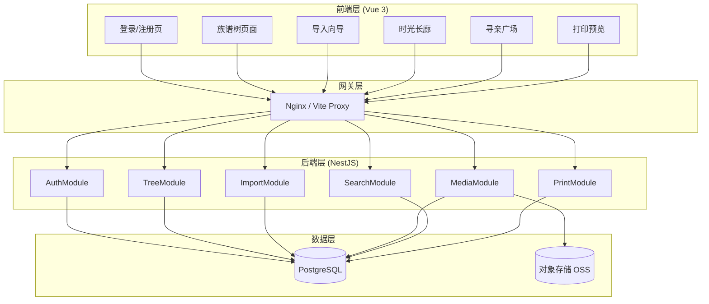
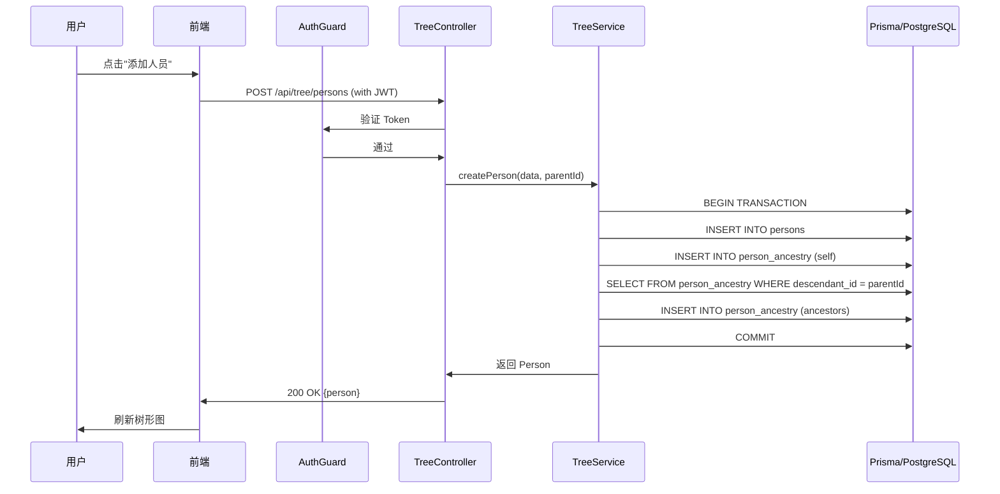

现在我已经充分了解了项目现状。根据收集到的所有信息，我将为用户生成一个完整的开发计划。让我整理所有发现：

**项目现状总结：**

1. **Monorepo 结构**：pnpm workspace，包含 `apps/web`、`apps/server`、`packages/db`
2. **前端**：Vue 3 + Vite + Element Plus + AntV G6 + Pinia + Vue Router（已有基础页面）
3. **后端**：NestJS + Prisma + PostgreSQL（已有 auth、tree、import、media、search、print 模块）
4. **数据库**：已有 Prisma schema，包含 users、clans、persons、family_units、person_ancestry、media 等表
5. **已完成功能**：登录/注册、基础建树、Excel 导入、寻亲搜索、媒体档案

**需要补充的功能**（根据需求文档）：

- Sprint 1: 家族创建功能
- Sprint 2: 完整的族谱树展示与交互
- Sprint 3: 完整的 Excel 导入向导 UI、时光长廊
- Sprint 4: 寻亲广场完整功能、PDF 生成与印刷

现在生成完整的开发计划：</think>```xml
<plan_result>
<req>

## 用户需求分析

用户要求根据《寻根路（xungenlu.cn）前端页面设计规范 v1.0.md》及相关需求文档，完成以下两项核心任务：

### 任务一：环境配置与工具安装

分析并安装开发所需的必要 Skill 和 MCP（模型上下文协议）工具，确保环境配置完整。

### 任务二：制定详细开发计划

包含项目阶段划分、各阶段核心任务、技术实现路径、关键里程碑节点及交付物标准，确保开发计划逻辑清晰、步骤可执行，并与原始需求目标严格对齐。

---

## 项目背景

**项目名称**：寻根路（xungenlu.cn）

**项目愿景**：打造中国首个集数字化修谱、智能化寻亲、聚落化记忆于一体的文化传承平台。

**核心价值**：

- 于个人：找到我是谁，我从哪里来，我的根在何处
- 于家族：打破地域限制，凝聚族人，续写家史
- 于社会：数字化保存村落记忆，助力文化自信与乡村振兴

---

## 现有项目状态分析

### 已完成的基础设施

1. **Monorepo 架构**（pnpm workspace）

- `apps/web`：前端应用（Vue 3 + Vite）
- `apps/server`：后端服务（NestJS）
- `packages/db`：数据库模块（Prisma + PostgreSQL）

2. **前端技术栈已配置**

- Vue 3 + TypeScript + Vite
- Element Plus UI 组件库
- AntV G6 图谱可视化
- Pinia 状态管理
- Vue Router 路由

3. **后端技术栈已配置**

- NestJS + TypeScript
- Prisma ORM + PostgreSQL
- JWT 认证机制
- 已有模块：auth、tree、import、media、search、print

4. **数据库 Schema 已设计**

- 用户体系：users、clans
- 族谱核心：persons、family_units、family_children、person_ancestry（闭包表）
- 扩展模块：media_archives、media_person_links、search_posts

5. **部分功能已基本实现**

- 用户登录/注册（JWT 认证）
- 人员创建与闭包表维护
- 子树查询与树形结构返回
- Excel 数据导入
- 寻亲帖搜索（字辈匹配）
- 媒体档案上传

### 待完善的功能缺口

1. **Sprint 1 剩余任务**

- 家族创建与管理功能
- 管理员权限体系完善

2. **Sprint 2 剩余任务**

- 完整的族谱树可视化（AntV G6 深度集成）
- 节点交互（点击、编辑、删除）
- 家庭成员关系管理（夫妻、入赘、过继）

3. **Sprint 3 任务**

- Excel 导入向导 UI（分步骤：上传→列映射→确认）
- 时光长廊页面（按年份排序的照片墙）
- 聚落影像互联逻辑

4. **Sprint 4 任务**

- 寻亲广场完整前端页面
- PDF 族谱生成与打印预览
- 在线下单流程（模拟支付）

---

## 核心功能需求详述

### 功能模块一：智能数据录入与建树

- Excel 导入：标准化模板一键导入，自动识别父子、配偶关系
- 手动录入：表单方式逐人添加，支持拖拽调整节点
- 中式关系适配：支持字辈、过继、入赘、兼祧等中国特色宗法关系

### 功能模块二：可视化交互与多端适配

- 族谱树展示：基于 AntV G6 的高性能树状图
- 多视图切换：树状图、思维导图、时间轴
- 节点交互：点击查看详情、编辑、添加亲属

### 功能模块三：个人详情"博客页"

- 生平事迹：富文本编辑，记录生平大事
- 影像馆：聚合相关照片、视频、口述历史
- 血缘路径：展示"你是某某的第几代孙"

### 功能模块四：寻亲与支系合并

- 发布寻亲帖：祖籍地、字辈、关键祖先名
- 智能匹配：基于字辈相似度和地名重合度
- 归宗仪式感：支系挂载引导，生成归宗纪念页

### 功能模块五：时光长廊与聚落记忆

- 家族时光轴：按时间线展示重大事件与老照片
- 聚落影像互联：打破单一家族界限，按村寨聚合
- 同频推荐：同一年代、同一村寨的照片共同展示

### 功能模块六：一键印刷与出版

- 模板化排版：仿古宣纸、现代精装等多种 PDF 模板
- 在线预览：所见即所得，支持分卷
- 一本起订：对接数码快印供应链

### 功能模块七：安全与权限体系

- 家族自治：管理员审核数据、管理成员
- 亲属验证登录：新成员需回答家族问题
- 隐私保护：在世之人信息默认脱敏

---

## 交付物标准

### 代码质量

- 所有代码注释和变量名使用英文
- UI 文本可使用中文
- 数据库使用 snake_case，TypeScript 使用 camelCase
- 后端使用 DTO 进行输入验证
- 每个函数必须有对应的单元测试或 E2E 测试逻辑

### 功能验收

- Sprint 1：能用管理员账号登录，并创建一个家族
- Sprint 2：手动插入 3 代 7 人数据，前端能正确渲染树，层级关系正确
- Sprint 3：成功导入 Excel 并生成树；能看到时光长廊；同村照片推荐逻辑生效
- Sprint 4：完整的寻亲发布与匹配流程；成功生成可下载的 PDF 族谱

### 文档交付

- 前端页面设计规范（补充完整）
- API 接口文档
- 数据库设计文档
- 部署运维文档
</req>

<tech>

## 技术栈选型

### 现有栈（已配置，继续沿用）

- **前端框架**：Vue 3 + Vite + TypeScript
- **UI 组件库**：Element Plus
- **状态管理**：Pinia
- **图谱可视化**：AntV G6 v5
- **路由**：Vue Router 4
- **HTTP 客户端**：Axios

- **后端框架**：NestJS + TypeScript
- **ORM**：Prisma + PostgreSQL
- **认证**：JWT + Passport
- **Excel 处理**：xlsx
- **PDF 生成**：Puppeteer Core + Handlebars
- **文件上传**：Multer + Ali OSS（阿里云对象存储）

### 需要新增的工具/依赖

- **前端**
- `@antv/g6-extension`：G6 扩展插件（如需更丰富的节点类型）
- `dayjs`：日期处理
- `html2pdf.js` 或前端 PDF 预览方案

- **后端**
- `@nestjs/swagger`：API 文档自动生成
- `class-validator`、`class-transformer`：已安装，需完善 DTO 验证
- `pHash` 或类似库：图像感知哈希（用于相似照片推荐）

---

## 实现方案

### 总体策略

采用**迭代增量开发**模式，按照四个 Sprint 逐步推进。每个 Sprint 结束后进行人工验收，确保功能正确后再进入下一阶段。

### Sprint 1：地基与身份认证（补充完善）

**目标**：跑通前后端，实现家族创建和管理员登录

**已实现**：

- 用户登录/注册 API（JWT）
- 登录/注册前端页面

**待实现**：

- 家族创建 API（后端已有一部分，需完善）
- 家族管理前端页面
- 用户与家族的关联关系

**技术路径**：

1. 完善 `ClanModule`，实现创建家族、获取家族信息接口
2. 前端新增家族管理相关页面和组件
3. 完善 JWT Guard，支持家族级别的权限控制

### Sprint 2：核心心脏——闭包表与建树

**目标**：实现中式族谱的数据存储与基础展示

**已实现**：

- 闭包表数据库设计（person_ancestry）
- 新增人员 API（自动维护闭包表）
- 查询子树 API
- 基础 G6 树组件（GenealogyTree.vue）

**待完善**：

- G6 树的深度集成（节点样式、布局算法）
- 节点交互（点击高亮、查看详情、编辑、删除）
- 家庭成员关系管理（夫妻、家庭单元）

**技术路径**：

1. 设计 G6 自定义节点（显示头像、姓名、生卒年）
2. 实现树布局算法（垂直树或水平树）
3. 实现节点点击事件（高亮、详情面板）
4. 实现添加亲属功能（父/母、配偶、子女）
5. 完善闭包表的删除逻辑（删除中间节点时清理所有下游路径）

**性能考量**：

- 闭包表查询利用索引（ancestor_id, descendant_id）
- 大族群谱采用懒加载或虚拟滚动
- G6 使用 Canvas 渲染，支持万级节点

### Sprint 3：功能深化——Excel 导入与时光长廊

**目标**：实现数据批量导入和情感化功能

**已实现**：

- Excel 解析服务（后端）
- 基础导入逻辑

**待实现**：

- 导入向导 UI（前端，分步骤）
- 时光长廊页面
- 聚落影像互联逻辑

**技术路径**：

1. 前端实现分步向导组件（Step 1: 上传 → Step 2: 列映射 → Step 3: 确认）
2. 实现列映射逻辑（用户拖拽或选择 Excel 列与数据库字段的对应关系）
3. 时光长廊：按年份分组展示媒体档案，瀑布流布局
4. 聚落推荐：基于 GeoHash 或地名相似度，推荐同村不同家族的照片

### Sprint 4：商业闭环——寻亲与印刷

**目标**：实现高价值功能和支付转化

**已实现**：

- 寻亲搜索 API（后端，支持字辈模糊匹配）
- 媒体档案上传

**待实现**：

- 寻亲广场前端页面
- PDF 族谱生成
- 打印预览与下单流程

**技术路径**：

1. 寻亲广场：列表 + 搜索 + 发布表单
2. PDF 生成：基于 Handlebars 模板 + Puppeteer
3. 打印预览：前端 iframe 展示 PDF
4. 模拟支付流程（为未来真实支付预留接口）

---

## 实现要点

### 数据库层面

- **闭包表维护**：每次新增/删除/移动人员时，必须同步更新 person_ancestry
- **索引优化**：person_ancestry 表需建立 (ancestor_id, descendant_id) 复合索引
- **事务保证**：人员创建、闭包表更新必须在同一事务中

### 后端层面

- **DTO 验证**：所有输入使用 class-validator 进行严格验证
- **错误处理**：统一异常过滤器，返回友好的错误信息
- **日志规范**：使用 NestJS 内置 Logger，关键操作记录日志

### 前端层面

- **状态管理**：使用 Pinia 管理用户状态、族谱树数据
- **API 封装**：统一 Axios 实例，自动附加 JWT Token
- **错误处理**：API 调用失败时使用 Element Plus Message 提示用户

### 安全层面

- **JWT 认证**：所有 API（除登录注册外）需验证 Token
- **家族隔离**：查询数据时需验证用户有权访问该家族
- **敏感信息加密**：联系方式使用 AES-256-CBC 加密存储

---

## 架构设计

### 系统架构图



### 数据流图（以创建人员为例）



---

## 目录结构规划

### 前端目录（已有，需补充）

```
apps/web/src/
├── api/                    # [已有，需补充] 接口定义
│   ├── auth.ts             # 认证相关 API
│   ├── tree.ts             # 族谱树 API
│   ├── import.ts           # 导入相关 API
│   ├── media.ts            # 媒体档案 API
│   ├── search.ts           # 寻亲相关 API
│   └── print.ts            # 打印相关 API
├── assets/                 # [已有] 静态资源
├── components/             # [已有，需补充]
│   ├── GenealogyTree.vue   # [已有] 族谱树组件
│   ├── ImportWizard.vue    # [NEW] 导入向导组件
│   ├── TimelineView.vue    # [NEW] 时光长廊组件
│   └── PersonDetail.vue    # [NEW] 人物详情组件
├── layouts/                # [NEW] 布局组件
│   └── MainLayout.vue      # 主布局（侧边栏 + 内容区）
├── pages/                  # [NEW] 页面组件（按模块组织）
│   ├── auth/
│   │   ├── LoginPage.vue
│   │   └── RegisterPage.vue
│   ├── tree/
│   │   └── TreePage.vue
│   ├── import/
│   │   └── ImportPage.vue
│   ├── timeline/
│   │   └── TimelinePage.vue
│   ├── search/
│   │   └── SearchPage.vue
│   └── print/
│       └── PrintPage.vue
├── router/                 # [已有，需补充]
│   └── index.ts           # 路由配置
├── store/                  # [已有，需补充]
│   ├── auth.ts            # 认证状态
│   ├── genealogy.ts       # 族谱状态
│   ├── import.ts          # 导入状态 [NEW]
│   ├── media.ts           # 媒体状态 [NEW]
│   └── search.ts          # 寻亲状态 [NEW]
├── utils/                  # [NEW] 工具函数
│   ├── request.ts         # Axios 实例封装
│   └── constants.ts       # 常量定义
└── types/                  # [NEW] TypeScript 类型定义
    └── index.ts
```

### 后端目录（已有，需补充）

```
apps/server/src/
├── auth/                   # [已有]
│   ├── dto/
│   ├── auth.controller.ts
│   ├── auth.service.ts
│   ├── jwt-auth.guard.ts
│   └── auth.module.ts
├── tree/                   # [已有，需补充]
│   ├── dto/
│   │   └── create-person.dto.ts
│   ├── tree.controller.ts
│   ├── tree.service.ts
│   └── tree.module.ts
├── clan/                   # [NEW] 家族管理模块
│   ├── dto/
│   ├── clan.controller.ts
│   ├── clan.service.ts
│   └── clan.module.ts
├── import/                 # [已有]
│   ├── dto/
│   ├── import.controller.ts
│   ├── import.service.ts
│   └── import.module.ts
├── media/                  # [已有]
│   ├── dto/
│   ├── media.controller.ts
│   ├── media.service.ts
│   └── media.module.ts
├── search/                 # [已有]
│   ├── dto/
│   ├── search.controller.ts
│   ├── search.service.ts
│   └── search.module.ts
├── print/                  # [已有]
│   ├── templates/         # [已有]
│   ├── print.controller.ts
│   ├── print.service.ts
│   └── print.module.ts
├── common/                 # [NEW] 公共模块
│   ├── decorators/         # 自定义装饰器
│   ├── filters/            # 异常过滤器
│   └── pipes/              # 管道
├── app.controller.ts       # [已有]
├── app.module.ts           # [已有]
├── app.service.ts          # [已有]
└── main.ts                 # [已有]
```

---

## 关键代码结构

### 后端 DTO 示例

```typescript
// apps/server/src/tree/dto/create-person.dto.ts
import { IsString, IsEnum, IsOptional, IsDate } from 'class-validator';
import { Type } from 'class-transformer';

export class CreatePersonDto {
  @IsString()
  full_name: string;

  @IsEnum(['male', 'female'])
  gender: 'male' | 'female';

  @IsOptional()
  @Type(() => Date)
  birth_date?: Date;

  @IsOptional()
  @Type(() => Date)
  death_date?: Date;

  @IsOptional()
  is_living?: boolean;

  @IsOptional()
  clan_id?: bigint;
}

export class AddPersonWithRelationDto extends CreatePersonDto {
  @IsOptional()
  parent_id?: bigint;

  @IsOptional()
  spouse_id?: bigint;

  @IsOptional()
  family_id?: bigint;
}
```

### 前端 API 封装示例

```typescript
// apps/web/src/api/tree.ts
import request from '@/utils/request';
import type { GenealogyNode } from '@/types';

export const treeApi = {
  // 获取子树
  getSubTree: (rootPersonId: string) =>
    request.get(`/api/tree/subtree/${rootPersonId}`),

  // 创建人员
  createPerson: (data: any) =>
    request.post('/api/tree/persons', data),

  // 更新人员
  updatePerson: (id: string, data: any) =>
    request.put(`/api/tree/persons/${id}`, data),

  // 删除人员
  deletePerson: (id: string) =>
    request.delete(`/api/tree/persons/${id}`),

  // 移动子树
  moveSubTree: (subtreeRootId: string, newParentId: string) =>
    request.post('/api/tree/move', { subtreeRootId, newParentId }),
};
```

</tech>

<design framework="Vue3" component="Element Plus">
<description>

## 设计风格定位

寻根路作为一款文化传承类产品，设计风格应当体现**庄重、典雅、现代**的气质，融合传统文化内涵与现代交互体验。

### 整体风格

采用**新中式现代风格**，以素雅色调为主，配合传统纹样元素和现代卡片式布局，营造出既有文化厚重感又不失现代便捷性的用户体验。

### 色彩体系

- **主色调**：深棕色（#5D4037）+ 暗金色（#C9A96E），体现族谱的厚重与珍贵
- **辅助色**：素雅灰（#F5F5F5）、米白（#FAF8F5）
- **功能色**：成功绿（#67C23A）、警告橙（#E6A23C）、错误红（#F56C6C）

### 字体系统

- **标题**：使用具有文化感的字体，如"思源宋体"或"方正清刻本悦宋"
- **正文**：PingFang SC / Microsoft YaHei，确保可读性
- **数字/英文**：使用 Roboto 或 Open Sans

### 布局架构

- **PC 端**：左侧导航 + 顶部面包屑 + 中央内容区
- **族谱树页面**：左树右详情布局，左侧占 70% 宽度展示树，右侧占 30% 展示选中节点详情
- **列表页面**：卡片式布局，支持网格/列表切换

### 关键页面设计

#### 1. 登录/注册页

- 全屏背景：使用淡雅的中国风背景图（如宣纸纹理、水墨山水）
- 中央登录卡片：半透明毛玻璃效果，边框使用暗金色
- 输入框：简洁线条，聚焦时暗金色高亮

#### 2. 族谱树页面

- 顶部工具栏：缩放、布局切换、搜索、添加人员
- 中央画布：AntV G6 渲染区域，支持拖拽、缩放、选中
- 右侧详情面板：
- 人物头像（占位符为姓氏 initials）
- 基本信息表格
- 操作按钮（编辑、添加亲属、查看详情）
- 关联照片缩略图

#### 3. 导入向导页面

- 分步指示器（Steps 组件）
- Step 1：拖拽上传区域，支持预览
- Step 2：列映射表格，左侧为 Excel 列名，右侧为下拉选择目标字段
- Step 3：数据预览表格，高亮错误行

#### 4. 时光长廊页面

- 时间轴布局：左侧年份，右侧照片卡片
- 瀑布流展示：照片高度自适应
- 点击照片：Lightbox 大图预览，显示拍摄年份、地点、相关人物

#### 5. 寻亲广场页面

- 顶部搜索栏：支持地名、字辈关键词搜索
- 帖子卡片列表：卡片包含标题、祖籍地、字辈、发布时间
- 发布按钮：浮动按钮，点击弹出发布表单对话框

#### 6. 个人详情"博客页"

- 顶部：人物头像 + 姓名 + 生卒年
- 标签页：生平简介 | 影像馆 | 血缘路径 | 编辑模式
- 生平简介：富文本展示，支持大段文字
- 影像馆：照片网格，支持上传
- 血缘路径：面包屑形式展示"某某的第几代孙"

### 交互动效

- 页面切换：淡入淡出过渡
- 卡片悬停：轻微上浮 + 阴影加深
- 树节点点击：脉冲高亮动画
- 保存成功：右上角 Toast 提示

### 响应式设计

- 桌面端（>1200px）：完整布局
- 平板端（768px~1200px）：左侧导航可收起
- 移动端（<768px）：底部 Tab 导航，树形图全屏展示
</description>
<style_keywords>
<keyword>新中式</keyword>
<keyword>典雅</keyword>
<keyword>素雅</keyword>
<keyword>文化传承</keyword>
<keyword>毛玻璃</keyword>
<keyword>暗金色</keyword>
<keyword>宣纸纹理</keyword>
<keyword>卡片式布局</keyword>
<keyword>瀑布流</keyword>
</style_keywords>
<font_system fontFamily="PingFang SC">
<heading size="24px" weight="600"></heading>
<subheading size="18px" weight="500"></subheading>
<body size="14px" weight="400"></body>
</font_system>
<color_system>
<primary_colors>
<color>#5D4037</color>
<color>#C9A96E</color>
<color>#8D6E63</color>
</primary_colors>
<background_colors>
<color>#FAF8F5</color>
<color>#F5F5F5</color>
<color>#FFFFFF</color>
</background_colors>
<text_colors>
<color>#333333</color>
<color>#666666</color>
<color>#999999</color>
</text_colors>
<functional_colors>
<color>#67C23A</color>
<color>#E6A23C</color>
<color>#F56C6C</color>
<color>#409EFF</color>
</functional_colors>
</color_system>
</design>

<extensions>

## Agent Extensions 使用计划

### 可用 Skill

根据当前上下文，以下 Skill 可用于辅助开发：

1. **code-explorer**（SubAgent）

- 用途：在需要跨多个文件、目录或模式进行搜索时使用
- 预期效果：快速定位需要修改的代码位置，理解现有代码架构

2. **find-skills**（Skill）

- 用途：当用户需要寻找更多功能扩展时使用
- 预期效果：发现并安装适合族谱项目开发的额外 Skill

### 当前无可用 MCP 工具

根据上下文，当前没有已连接的 MCP 工具。建议在开发过程中根据需要配置以下 MCP：

- 数据库连接 MCP（用于直接查询 PostgreSQL）
- 文件操作 MCP（用于批量文件处理）

### Skill 安装建议

根据用户需求"安装开发所需的必要 Skill"，建议使用 [skill:find-skills] 来查找和安装以下类型的 Skill：

- 数据库设计/查询 Skill
- API 测试 Skill
- 文档生成 Skill
</extensions>

<todolist>
<item id="analyze-and-install-skills" deps="">使用 [skill:find-skills] 查找并安装开发所需的 Skill（数据库、API 测试、文档生成等）</item>
<item id="create-frontend-design-doc" deps="">补充《前端页面设计规范 v1.0.md》文档内容（当前文件为空）</item>
<item id="complete-sprint1-clan" deps="analyze-and-install-skills">完善 Sprint 1 剩余功能：家族创建与管理后端 API 及前端页面</item>
<item id="enhance-genealogy-tree" deps="complete-sprint1-clan">完善 Sprint 2：深度集成 AntV G6，实现完整的族谱树可视化与节点交互</item>
<item id="implement-import-wizard" deps="enhance-genealogy-tree">实现 Sprint 3：Excel 导入向导 UI（上传→列映射→确认三步流程）</item>
<item id="build-timeline-media" deps="implement-import-wizard">实现 Sprint 3：时光长廊页面与聚落影像互联推荐功能</item>
<item id="develop-search-square" deps="build-timeline-media">实现 Sprint 4：寻亲广场前端页面与寻亲帖发布/匹配功能</item>
<item id="implement-pdf-print" deps="develop-search-square">实现 Sprint 4：PDF 族谱生成、打印预览与模拟下单流程</item>
<item id="write-tests-docs" deps="implement-pdf-print">编写单元测试、E2E 测试及 API 文档，完成项目交付</item>
</todolist>
</plan_result>
```