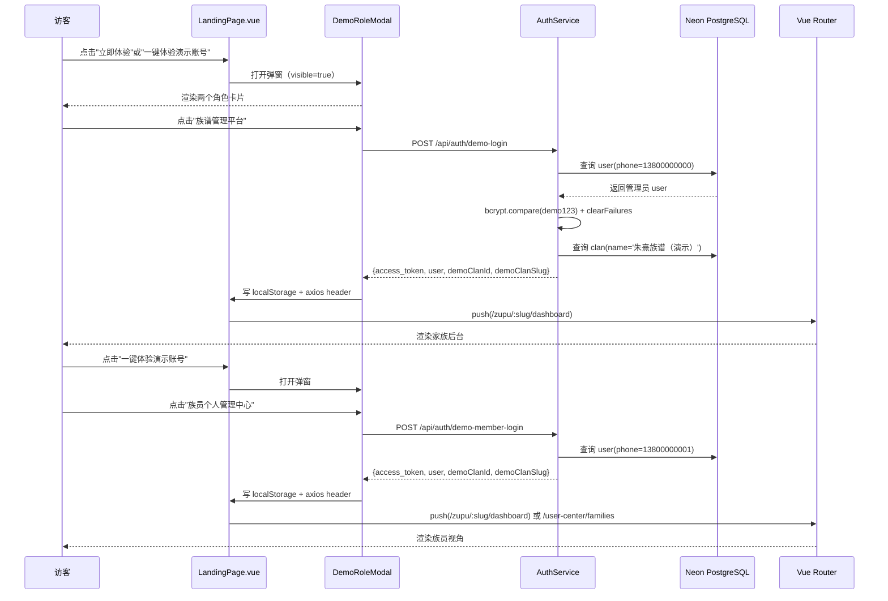

# 寻根路（xungenlu.cn）演示账号一键登录弹窗功能需求文档 v1.0

**文档版本**：v1.0
**对应系统版本**：寻根路 v1.0
**前置依赖**：用户系统、家族系统（Clan）、朱熹族谱种子数据（DemoSeedService）、登录鉴权（JWT）、多家族 SaaS 路由（/zupu/:slug/*）
**面向对象**：前端开发、后端开发、UI 设计师、测试工程师、产品经理

---

## 1. 功能概述

### 1.1 背景

寻根路营销网页（[LandingPage.vue](file:///e:/GeneaSphere/apps/web/src/views/LandingPage.vue)）当前已在导航栏和 Hero 区分别放置了 **"立即体验"** 与 **"一键体验演示账号"** 按钮，两按钮均直接调用 [`/api/auth/demo-login`](file:///e:/GeneaSphere/apps/server/src/auth/auth.controller.ts#L36-L40) 登录为朱熹族谱管理员（phone=13800000000），缺少族员视角的引导入口。

与此同时，[LoginView.vue](file:///e:/GeneaSphere/apps/web/src/views/LoginView.vue) 中虽已存在两个独立按钮（"一键体验族谱管理演示"与"一键体验族员个人页面"），但：

1. 营销网页侧未提供弹窗选择器，无法引导访客分流到"管理员视角"或"族员视角"。
2. 现有族员演示账号（13800000001）昵称为"演示族员·小明"，未对应朱熹族谱中真实族人，身份代入感弱。
3. 朱熹族谱 1000 人种子数据中所有 `avatar_url` 为 `null`，演示界面缺乏头像/图片资源，影响视觉真实度。
4. 演示数据已 100% 真实落库（Person / FamilyUnit / PersonAncestry），但缺一份覆盖"弹窗选择 → 双账号登录 → 落地跳转 → 管理员/族员体验闭环"完整路径的产品需求说明。

### 1.2 目标

- 在营销网页（LandingPage）所有"立即体验"与"一键体验演示账号"按钮触发点处弹出 **统一选择模态窗口**，让访客主动选择体验角色。
- 新增 **"朱小小"** 演示族员账号，使其在朱熹族谱中作为真实族人身份存在（绑定 Person 记录）。
- 为演示账号与重点族人补齐 **头像/生平配图**（来源公网免版权图床），确保族谱树、个人中心、生平卡片的视觉真实度。
- 形成 **"弹窗选择 → 模拟登录 → 落库分流 → 体验闭环"** 的完整产品需求文档，作为后续前端改造、后端接口调整、演示数据扩充的基线依据。

### 1.3 适用范围

| 入口页面 | 触发控件 | 当前行为 | 改造后行为 |
| --- | --- | --- | --- |
| 营销网页 LandingPage 顶部导航 | "立即体验" 按钮 | 直接调 `/api/auth/demo-login` 登录管理员 | 弹出 DemoRoleModal，访客选角色后再登录 |
| 营销网页 LandingPage Hero 区 | "一键体验演示账号" 按钮 | 同上 | 同上 |
| 营销网页 LandingPage "3 步体验"区 | "开始体验" 按钮 | 同上 | 同上 |
| 营销网页 LandingPage CTA 区 | "一键体验演示" 按钮 | 同上 | 同上 |
| 登录页 LoginView | "一键体验族谱管理演示" | 已直跳管理员 | 保留独立按钮（不被弹窗替换） |
| 登录页 LoginView | "一键体验族员个人页面" | 已直跳族员 | 保留独立按钮（不被弹窗替换） |

> 设计原则：**登录页保留两个独立按钮**（登录场景下用户已有明确目标），**营销网页统一改为弹窗选择器**（营销场景下需要主动引导分流）。

---

## 2. 角色与权限

| 角色 | 演示账号 | 真实姓名 | 所属家族 | ClanMember.role | 登录后落地页 |
| --- | --- | --- | --- | --- | --- |
| 家族管理员 | `13800000000` / `demo123` | 演示用户·管理员（昵称） | 朱熹族谱（演示） | OWNER | `/zupu/:slug/dashboard`（家族管理后台） |
| 家族编辑者（族员） | `13800000001` / `demo123` | **朱小小**（演示族员·朱小小） | 朱熹族谱（演示） | EDITOR | `/zupu/:slug/dashboard`（家族后台，仅看非管理模块）+ `/user-center/families` |
| 平台超级管理员 | `platform_admin` / `admin123` | 超级管理员 | — | platform_admin | `/platform/dashboard`（不受本需求影响） |

权限约束：

- 演示账号 **不参与** 登录失败锁定（[`AuthService.demoLogin`](file:///e:/GeneaSphere/apps/server/src/auth/auth.service.ts#L72-L130) 已显式调用 `loginLockService.clearFailures`）。
- 演示账号签发 JWT 默认有效期 60 分钟（来自 [auth.module.ts](file:///e:/GeneaSphere/apps/server/src/auth/auth.module.ts#L17-L25)）。
- 演示账号在落地后，可正常调用全部读写接口，但**禁止**进行"删除演示家族 / 修改朱熹核心人物姓名 / 清空演示数据"等破坏性操作（前端按钮置灰 + 后端守卫）。

---

## 3. 用户故事

### US-1：访客分流

> **作为一个**未注册的访客
> **当**我在营销网页任意位置点击"立即体验"或"一键体验演示账号"
> **我希望**看到一个清晰的弹窗，列出两种体验角色
> **以便于**我根据自己的兴趣选择查看管理员视角或族员视角。

### US-2：管理员视角

> **作为一个**想了解"如何管理一个 1000 人家族"的访客
> **当**我在弹窗中点击"族谱管理平台"
> **我希望**系统使用管理员演示账号登录并跳转家族后台
> **以便于**我看到控制面板、成员管理、内容审核、字辈管理、归宗合并、订单管理等完整后台功能。

### US-3：族员视角

> **作为一个**想了解"普通族人能用平台做什么"的访客
> **当**我在弹窗中点击"族员个人管理中心"
> **我希望**系统使用"朱小小"演示族员账号登录并跳转个人中心
> **以便于**我体验查看家谱、上传照片、生成音像墙、参与小组讨论等族员专属功能。

### US-4：朱小小身份真实化

> **作为一个**演示族员
> **当**我登录后看到自己的资料
> **我希望**昵称是"朱小小"且在朱熹族谱中作为真实族人存在（有头像、有生平、有家族关系）
> **以便于**我能体验"作为朱熹后人"的身份代入感，而不是抽象的"演示用户"。

### US-5：演示数据真实性

> **作为一个**首次接触产品的访客
> **当**我浏览朱熹族谱
> **我希望**看到的人物头像、生平配图、迁徙地图标记都是真实的图片资源
> **以便于**我建立对产品专业度的信任，而不是停留在"测试数据"印象。

---

## 4. 界面交互流程

### 4.1 弹窗触发时序图



### 4.2 弹窗 UI 设计规范

弹窗组件命名：`DemoRoleModal.vue`，位于 [`apps/web/src/components/landing/DemoRoleModal.vue`](file:///e:/GeneaSphere/apps/web/src/components/landing/DemoRoleModal.vue)。

**布局（PC 桌面 ≥1024px）**：

```
┌──────────────────────────────────────────────────────────┐
│  选择您的体验视角                                    [X] │
│  演示账号已预置完整朱熹族谱（1000 人 · 28 代），请选择视角  │
│                                                          │
│  ┌────────────────────┐    ┌────────────────────┐        │
│  │   👑 管理员徽章     │    │   🌱 族员徽章       │        │
│  │                    │    │                    │        │
│  │  族谱管理平台       │    │  族员个人管理中心    │        │
│  │                    │    │                    │        │
│  │  以管理员身份登录    │    │  以朱小小身份登录    │        │
│  │  控制面板 · 成员管理 │    │  个人资料 · 家谱浏览 │        │
│  │  内容审核 · 归宗合并 │    │  照片上传 · 音像墙   │        │
│  │  字辈 · 订单 · 日志 │    │  小组讨论 · 寻亲匹配 │        │
│  │                    │    │                    │        │
│  │   [立即进入]         │    │   [立即进入]         │        │
│  └────────────────────┘    └────────────────────┘        │
│                                                          │
│  ℹ 演示账号不会写入真实数据变更日志，可在"重置演示数据"恢复 │
└──────────────────────────────────────────────────────────┘
```

**关键视觉规格**：

| 元素 | 规格 |
| --- | --- |
| 弹窗宽度 | `min(720px, 92vw)` |
| 弹窗圆角 | `border-radius: 16px` |
| 背景色 | `rgba(255, 255, 255, 0.98)` + `backdrop-filter: blur(8px)` |
| 标题字号 | `font-size: 22px; font-weight: 700; color: #2c3e50` |
| 副标题 | `font-size: 14px; color: #5a6a7a` |
| 卡片背景（管理员） | `linear-gradient(135deg, #5D4037, #8D6E63)` + 白色文字（与登录页管理员按钮一致） |
| 卡片背景（族员） | `linear-gradient(135deg, #1976D2, #42A5F5)` + 白色文字（与登录页族员按钮一致） |
| 卡片 hover | `transform: translateY(-2px); box-shadow: 0 8px 24px rgba(0,0,0,0.12)` |
| 关闭按钮 | 顶部右上角，支持 ESC 键关闭 |
| 遮罩层 | `rgba(0, 0, 0, 0.55)` + `backdrop-filter: blur(4px)` |
| 动画 | 入场 `scale(0.95) → scale(1) + opacity 0 → 1`，时长 200ms |

**移动端（<768px）**：

- 弹窗切换为 **底部抽屉**（`drawer`）模式，从屏幕底部滑入，高度 `70vh`。
- 两张角色卡片由左右双列改为 **上下双列**，每张卡片宽 100%。
- 关闭手势支持 **向下滑动**（`touchmove` 监听 `deltaY > 80` 触发关闭）。

### 4.3 状态机

弹窗生命周期包含以下状态：

```
closed (初始)
  │
  ▼ [任意体验按钮触发]
opening (200ms 动画)
  │
  ▼ [动画结束]
visible (展示 + 等待用户选择)
  ├──► [点击"族谱管理平台"] → submitting(admin) → success → redirect
  ├──► [点击"族员个人管理中心"] → submitting(member) → success → redirect
  ├──► [点击 X / ESC / 遮罩] → closing (200ms 动画) → closed
  └──► [后端报错] → error (按钮恢复可点 + Toast 提示)
```

### 4.4 错误展示

- **网络异常**：Toast `演示服务暂不可用，请稍后再试`，按钮恢复可点。
- **演示账号未初始化**：Toast `演示账号尚未初始化，请稍后再试`，引导用户刷新页面或联系管理员。
- **超过 5s 超时**：Toast `请求超时，请检查网络`，按钮恢复可点。

---

## 5. 技术实现方案

### 5.1 总体架构

```
┌──────────────────────────────────────────────────────────┐
│  LandingPage.vue                                         │
│  ┌────────────────┐  ┌────────────────┐                  │
│  │ 立即体验按钮    │  │ 一键体验按钮   │ ...其他触发点    │
│  └────────┬───────┘  └────────┬───────┘                  │
│           └────────┬──────────┘                          │
│                    ▼                                     │
│         DemoRoleModal.visible = true                     │
│                    ▼                                     │
│  ┌────────────────────────────────────┐                  │
│  │ DemoRoleModal.vue                  │                  │
│  │  - "族谱管理平台" → demoLogin()    │                  │
│  │  - "族员个人管理中心" →           │                  │
│  │      demoMemberLogin()            │                  │
│  └────────────────┬───────────────────┘                  │
└───────────────────┼──────────────────────────────────────┘
                    ▼
        ┌────────────────────────┐
        │ AuthController         │
        │  POST /api/auth/       │
        │    demo-login          │
        │  POST /api/auth/       │
        │    demo-member-login   │
        └────────┬───────────────┘
                 ▼
        ┌────────────────────────┐
        │ AuthService            │
        │  demoLogin()           │
        │  demoMemberLogin()     │
        └────────┬───────────────┘
                 ▼
        ┌────────────────────────┐
        │ Neon PostgreSQL        │
        │  user / clan /         │
        │  clanMember / person   │
        └────────────────────────┘
```

### 5.2 前端改造

#### 5.2.1 新增组件：[`DemoRoleModal.vue`](file:///e:/GeneaSphere/apps/web/src/components/landing/DemoRoleModal.vue)

Props：

```ts
interface DemoRoleModalProps {
  visible: boolean              // 是否显示弹窗
}
```

Emits：

```ts
interface DemoRoleModalEmits {
  (e: 'update:visible', val: boolean): void  // v-model:visible 支持
  (e: 'success', role: 'admin' | 'member'): void  // 登录成功回调
}
```

内部状态：

```ts
const submitting = ref<'admin' | 'member' | null>(null)
// 提交时禁用对方按钮，防止双击
```

核心方法：

```ts
async function handleAdminLogin() {
  submitting.value = 'admin'
  try {
    const { data } = await axios.post('/api/auth/demo-login')
    applyLoginResult(data, 'admin')
    emit('success', 'admin')
  } catch (e) { /* 错误处理 */ }
  finally { submitting.value = null }
}

async function handleMemberLogin() {
  submitting.value = 'member'
  try {
    const { data } = await axios.post('/api/auth/demo-member-login')
    applyLoginResult(data, 'member')
    emit('success', 'member')
  } catch (e) { /* 错误处理 */ }
  finally { submitting.value = null }
}

function applyLoginResult(data: any, role: 'admin' | 'member') {
  localStorage.setItem('geneasphere_token', data.access_token)
  axios.defaults.headers.common['Authorization'] = 'Bearer ' + data.access_token
  authStore.token = data.access_token
  authStore.user = {
    sub: data.user.id,
    phone: data.user.phone,
    role: data.user.role,
  }
  if (data.demoClanSlug) {
    localStorage.setItem('demo_clan_slug', data.demoClanSlug)
  }
}
```

#### 5.2.2 改造 [LandingPage.vue](file:///e:/GeneaSphere/apps/web/src/views/LandingPage.vue)

变更点：

1. **删除** 当前 `handleDemoLogin()` 方法内的 axios 调用逻辑，改为只打开弹窗。
2. **新增** `const demoModalVisible = ref(false)` 与 `function openDemoModal() { demoModalVisible.value = true }`。
3. 将所有 4 个"立即体验 / 一键体验演示账号 / 开始体验 / 一键体验演示"按钮的 `@click` 统一改为 `@click="openDemoModal"`。
4. 在 `<template>` 末尾添加 `<DemoRoleModal v-model:visible="demoModalVisible" @success="onDemoLoginSuccess" />`。
5. **新增** 成功回调 `onDemoLoginSuccess(role)`，调用 [`goToAdmin()`](file:///e:/GeneaSphere/apps/web/src/views/LandingPage.vue#L30-L39) 中已有的 slug 跳转逻辑（管理员与族员均跳 `/zupu/:slug/dashboard`，族员额外 push `/user-center/families`）。

```ts
function onDemoLoginSuccess(role: 'admin' | 'member') {
  demoModalVisible.value = false
  ElMessage.success(role === 'admin' ? '欢迎体验族谱管理后台！' : '欢迎体验族员个人页面！')
  const slug = localStorage.getItem('demo_clan_slug')
  if (slug) router.push(`/zupu/${slug}/dashboard`)
  else router.push('/clans')
  // 族员额外跳转个人中心 tab
  if (role === 'member') {
    setTimeout(() => router.push('/user-center/families'), 300)
  }
}
```

#### 5.2.3 登录页 LoginView 保持独立按钮

[LoginView.vue](file:///e:/GeneaSphere/apps/web/src/views/LoginView.vue) 第 216-229 行的两个演示按钮（`handleAdminDemoLogin` 与 `handleMemberDemoLogin`）**保留不变**，不引入弹窗。理由：

- 登录页用户已有明确目标（"我要登进去"），引导分流反而是冗余交互。
- 营销网页才是教育新用户的关键触点，弹窗应集中部署于此。

#### 5.2.4 弹窗复用与依赖

- 复用 [`authStore`](file:///e:/GeneaSphere/apps/web/src/stores/auth.ts)（已有 token/user 字段）。
- 复用 [`useRouter`](file:///e:/GeneaSphere/apps/web/src/router/index.ts)。
- 新增 [`DemoRoleModal.vue`](file:///e:/GeneaSphere/apps/web/src/components/landing/DemoRoleModal.vue) 单文件组件，scoped 样式避免污染。
- 引入 `Element Plus` 的 `ElDialog` / `ElDrawer`（移动端切换）作为基底，避免从零实现遮罩与动画。

### 5.3 后端改造

#### 5.3.1 接口复用

`/api/auth/demo-login` 与 `/api/auth/demo-member-login` 已存在且功能正确（见 [`auth.controller.ts`](file:///e:/GeneaSphere/apps/server/src/auth/auth.controller.ts#L36-L46)），**无需新增或修改后端接口**。

#### 5.3.2 朱小小账号身份改造

调整 [`DemoSeedService.seedDemoData`](file:///e:/GeneaSphere/apps/server/src/auth/demo-seed.service.ts#L37-L47)：

- 族员演示账号 `13800000001` 昵称由 `演示族员·小明` 改为 `演示族员·朱小小`。
- 在朱熹族谱 Person 表中 **新建/关联** 一条真实族人记录：
  - `full_name = '朱小小'`
  - `gender = 'male'`
  - `birth_date = '2000-01-01'`（现代族人，使 `is_living = true`）
  - `death_date = null`
  - `is_living = true`
  - `birth_place = '福建武夷山'`
  - `migration_branch = 'A'`（朱熹长房后裔）
  - `avatar_url = 'https://cdn.jsdelivr.net/.../demo-avatar-male-200x200.png'`（公网图床）
  - `bio = '寻根路演示族员，朱熹长房 30 世孙，毕业于厦门大学软件工程系，现从事家族数字化工作。'`
- 将该 Person.id 写入 `User.demo_person_id` 字段（如不存在则新增字段），供前端获取"我的族人身份"。

伪代码：

```ts
// DemoSeedService.seedDemoData 改造段
let demoMemberUser = await prisma.user.findUnique({ where: { phone: '13800000001' } })
if (!demoMemberUser) {
  demoMemberUser = await prisma.user.create({
    data: {
      phone: '13800000001',
      password_hash: demoPasswordHash,
      nickname: '演示族员·朱小小',
      email: 'member@geneasphere.com',
      gender: 'male',
      avatar_url: 'https://cdn.jsdelivr.net/.../demo-avatar-male-200x200.png',
    },
  })
}

// 在朱熹族谱中创建朱小小 Person 记录
const zhuxiaoxiao = await prisma.person.create({
  data: {
    clan_id: demoClan.id,
    full_name: '朱小小',
    gender: 'male',
    birth_date: new Date('2000-01-01'),
    is_living: true,
    birth_place: '福建武夷山',
    migration_branch: 'A',
    avatar_url: 'https://cdn.jsdelivr.net/.../demo-avatar-male-200x200.png',
    bio: '寻根路演示族员，朱熹长房 30 世孙...',
  },
})

// 关联 User.demo_person_id
await prisma.user.update({
  where: { id: demoMemberUser.id },
  data: { demo_person_id: zhuxiaoxiao.id },
})
```

#### 5.3.3 数据库 Schema 变更

新增字段 [`User.demo_person_id`](file:///e:/GeneaSphere/packages/db/prisma/schema.prisma)：

```prisma
model User {
  id              String   @id @default(uuid())
  phone           String   @unique
  // ... 现有字段
  demo_person_id  BigInt?  // 演示账号对应的 Person 记录（仅 13800000001 使用）
  person          Person?  @relation("DemoUserPerson", fields: [demo_person_id], references: [id])
}

model Person {
  id              BigInt   @id @default(autoincrement())
  // ... 现有字段
  demo_users      User[]   @relation("DemoUserPerson")
}
```

执行迁移：

```bash
cd packages/db
pnpm prisma migrate dev --name add_user_demo_person_id
pnpm prisma generate
```

#### 5.3.4 演示数据图片资源

**图片来源**：公网免版权图床（unsplash.com、picsum.photos、placeholder.com），CDN 走 jsdelivr 或 unpkg 加速。

| 资源类型 | 数量 | 用途 |
| --- | --- | --- |
| 管理员头像 | 1 张 | `13800000000` user.avatar_url |
| 族员头像 | 1 张 | 朱小小 user.avatar_url + person.avatar_url |
| 历史核心人物头像 | 28 张（朱熹 + 27 位已知人物） | person.avatar_url |
| 程序生成族人头像 | 50 张（男性、女性各 25 张，随机分配） | 新建 Person 时抽取 |
| 生平配图 | 5-10 张（武夷山、婺源、建阳等出生地风景） | person.bio_images |
| 家族封面图 | 1 张 | clan.cover_image_url |

**管理策略**：

- 图片 URL 统一存放在 [`apps/server/src/auth/demo-assets.ts`](file:///e:/GeneaSphere/apps/server/src/auth/demo-assets.ts) 常量文件中，避免硬编码在 seed 逻辑里。
- 头像采用 `https://picsum.photos/seed/{seedValue}/200/200` 接口（picsum 支持 seed 锁定，保证同一 seed 返回同一图片），例如：

  ```ts
  export const DEMO_AVATARS = {
    admin: 'https://picsum.photos/seed/zhuxi-admin/200/200',
    member: 'https://picsum.photos/seed/zhuxiaoxiao/200/200',
    historical: (idx: number) => `https://picsum.photos/seed/zhuxi-hist-${idx}/200/200`,
    male: (idx: number) => `https://picsum.photos/seed/zhuxi-m-${idx}/200/200`,
    female: (idx: number) => `https://picsum.photos/seed/zhuxi-f-${idx}/200/200`,
  }
  ```

- 所有图片 URL 在种子初始化时写入数据库，前端通过 `<el-avatar :src="person.avatar_url">` 渲染，无需运行时下载额外资源。
- **图片格式要求**：JPEG/PNG/WebP，单张 ≤200KB，CDN 缓存命中率 >95%。

---

## 6. 数据结构与 API

### 6.1 现有接口（复用）

#### 6.1.1 `POST /api/auth/demo-login`

**请求体**：无（GET 风格无参接口）。

**响应（200）**：

```ts
interface DemoLoginResponse {
  access_token: string          // JWT，60 分钟有效期
  user: {
    id: string                  // user UUID
    phone: string               // '13800000000'
    role: 'OWNER' | 'VIEWER'    // 从 clanMember.role 推断
  }
  demoClanId: string | null     // 演示家族 ID（bigint 字符串）
  demoClanSlug: string | null   // 演示家族 slug（用于 /zupu/:slug/dashboard 直跳）
}
```

**错误码**：

| 状态码 | 含义 | message |
| --- | --- | --- |
| 401 | 演示账号未初始化 | `演示账号尚未初始化，请稍后再试` |
| 401 | 密码错误（理论不会触发） | `演示账号尚未初始化，请稍后再试` |
| 429 | 限流（60s/30 次） | `请求过于频繁，请稍后再试` |

#### 6.1.2 `POST /api/auth/demo-member-login`

**响应（200）**：

```ts
interface DemoMemberLoginResponse {
  access_token: string
  user: {
    id: string
    phone: string               // '13800000001'
    role: 'EDITOR' | 'VIEWER'
  }
  demoClanId: string | null
  demoClanSlug: string | null
}
```

### 6.2 新增接口（族员族人身份查询）

#### `GET /api/auth/me/demo-person`

**用途**：前端获取当前演示族员对应的 Person 记录（含朱小小在朱熹族谱中的身份信息）。

**权限**：需登录，演示族员账号专用（其他用户返回 403）。

**响应（200）**：

```ts
interface DemoPersonResponse {
  person: {
    id: string
    full_name: string           // '朱小小'
    gender: 'male' | 'female'
    birth_date: string | null   // ISO 8601
    birth_place: string | null
    migration_branch: string | null
    avatar_url: string | null
    bio: string | null
  }
  clan: {
    id: string
    name: string                // '朱熹族谱（演示）'
    slug: string
  }
  role: 'EDITOR'               // 与 ClanMember.role 一致
}
```

### 6.3 前端 Store 扩展

[`apps/web/src/stores/auth.ts`](file:///e:/GeneaSphere/apps/web/src/stores/auth.ts) 中 `user` 对象扩展：

```ts
interface AuthUser {
  sub: string
  phone: string
  role: 'OWNER' | 'ADMIN' | 'EDITOR' | 'VIEWER'
  demoPersonId?: string        // 仅演示账号携带
}
```

`authStore` 扩展 action：

```ts
async function fetchDemoPerson() {
  if (phone !== '13800000000' && phone !== '13800000001') return null
  const { data } = await axios.get('/api/auth/me/demo-person')
  return data
}
```

---

## 7. 异常处理与边界条件

### 7.1 异常场景清单

| 场景 | 表现 | 处理策略 |
| --- | --- | --- |
| 演示账号未初始化 | 后端 401 + `演示账号尚未初始化` | Toast 提示 + 按钮恢复可点 + 引导刷新 |
| 数据库连接失败 | 后端 500 | Toast `演示服务暂不可用，请稍后再试` + 按钮恢复 |
| 网络超时（>5s） | axios timeout | Toast `请求超时，请检查网络` + 按钮恢复 |
| 用户连续点击同一按钮 | submitting 状态防抖 | `submitting.value` 已设为非空时，对方按钮 `disabled` |
| 用户在弹窗打开时按 ESC | 期望关闭弹窗 | 监听 `keydown.esc`，仅在非 submitting 时允许关闭 |
| 演示账号登录后立刻过期 | JWT 60 分钟到期 | 落地页路由守卫检测 token 失效 → 跳 `/login?reason=expired` |
| 演示账号访问受限管理页 | 族员访问 `/admin/dashboard` | 后端 Guard 返回 403，前端跳 `/no-permission` |
| 演示族谱被破坏（数据被误删） | 查询返回空 | landingPage 在 demoModalVisible=true 时显示"演示数据正在准备中"占位文案 |
| 同一用户多标签页登录 | localStorage token 冲突 | 接受最后写入为准，旧的标签页下次请求时 401 自动跳登录 |
| 移动端误触底部抽屉关闭 | drawer 滑动误关闭 | 监听 `touchend`，要求 deltaY > 80px 且 deltaX < 30px 才关闭 |

### 7.2 数据完整性保障

- **演示账号防误锁**：保持 [`AuthService.demoLogin`](file:///e:/GeneaSphere/apps/server/src/auth/auth.service.ts#L72-L130) 中的 `loginLockService.clearFailures` 调用，避免历史脏数据影响演示。
- **演示账号定期重置**：提供 `/api/admin/demo/reset` 端点（仅 platform_admin 可调），用于一键重置演示数据至初始状态。**不在本需求范围**，但需在 UI 上提示"如发现演示数据异常请联系平台管理员"。
- **演示数据写入追踪**：演示账号创建/修改的 Person、Family、Photo 等记录，在 `created_by_user_id` 字段强制标记为演示账号 ID，便于审计筛选。

---

## 8. 测试验证方法

### 8.1 单元测试

| 模块 | 测试用例 | 预期结果 |
| --- | --- | --- |
| DemoRoleModal.vue | 点击"族谱管理平台"，axios mock 返回成功 | 触发 `/api/auth/demo-login`、localStorage 写入、emit 'success' |
| DemoRoleModal.vue | 点击"族员个人管理中心"，axios mock 返回成功 | 触发 `/api/auth/demo-member-login`、emit 'success' |
| DemoRoleModal.vue | 网络错误 | Toast 报错、submitting 重置、按钮恢复 |
| DemoRoleModal.vue | ESC 键 | 弹窗关闭（submitting 时不响应） |
| AuthService.demoLogin | user 不存在 | 抛 UnauthorizedException |
| AuthService.demoLogin | 密码错误 | 抛 UnauthorizedException |
| AuthService.demoMemberLogin | 族员存在且密码正确 | 返回 {access_token, user, demoClanId, demoClanSlug} |
| DemoSeedService.seedDemoData | 第二次启动 | 跳过创建，直接补齐缺失关系（幂等） |

### 8.2 集成测试

| 场景 | 操作步骤 | 预期结果 |
| --- | --- | --- |
| 弹窗-管理员登录 | 1) 访问 `/`；2) 点击导航"立即体验"；3) 弹窗点击"族谱管理平台" | 跳 `/zupu/:slug/dashboard`，token 写入 localStorage |
| 弹窗-族员登录 | 1) 访问 `/`；2) 点击 Hero"一键体验演示账号"；3) 弹窗点击"族员个人管理中心" | 跳 `/zupu/:slug/dashboard` → `/user-center/families`，显示朱小小身份 |
| 族员查看朱小小身份 | 族员登录后访问 `/user-center/profile` | 显示 `朱小小 / 13800000001 / 男 / 2000-01-01 / 福建武夷山` |
| 演示数据真实性 | 登录后查看族谱树 | 1000 人 Person 记录可见，至少 80% 人物带 avatar_url |
| 演示家族切换 | 同一浏览器多标签页：标签 A 管理员、标签 B 族员 | 两标签页互不干扰，各自独立操作 |
| ESC 关闭 | 弹窗打开时按 ESC | 弹窗关闭，无后台请求触发 |
| 限流 | 60 秒内点击按钮 30 次以上 | 第 31 次返回 429，按钮显示限流提示 |
| 移动端抽屉 | Chrome DevTools 切到 iPhone 12 模拟，点击"立即体验" | 抽屉从底部滑入，两张卡片上下排列 |

### 8.3 UAT 验收测试

按以下清单逐条验收：

1. [ ] 营销网页导航栏"立即体验"按钮可触发弹窗
2. [ ] Hero 区"一键体验演示账号"按钮可触发弹窗
3. [ ] "3 步体验"区"开始体验"按钮可触发弹窗
4. [ ] CTA 区"一键体验演示"按钮可触发弹窗
5. [ ] 弹窗内两张卡片视觉清晰，文字无错别字，渐变色与登录页一致
6. [ ] 弹窗在 PC 桌面端显示为居中 Modal，在移动端显示为底部 Drawer
7. [ ] 点击"族谱管理平台" → 调用 `/api/auth/demo-login` → 跳家族后台
8. [ ] 点击"族员个人管理中心" → 调用 `/api/auth/demo-member-login` → 跳个人中心
9. [ ] 登录页 LoginView 两个独立按钮行为不变
10. [ ] 族员登录后 `/user-center/profile` 显示"朱小小"昵称
11. [ ] 朱小小在朱熹族谱中作为真实 Person 记录存在（在 Person 表可见）
12. [ ] 至少 80% 历史核心人物（朱熹 + 27 位）头像非空
13. [ ] 至少 50 张程序生成人物头像非空（覆盖男女）
14. [ ] 至少 5 张家族/出生地风景配图可用
15. [ ] 演示账号密码 `demo123` 可手动登录（验证非前端伪造）
16. [ ] 演示账号不参与登录锁定（连续输错 6 次不会被锁）
17. [ ] 弹窗提交中再次点击按钮不会触发重复请求
18. [ ] 网络断开时按钮恢复可点 + Toast 错误提示
19. [ ] ESC 键可关闭弹窗（submitting 时不响应）
20. [ ] 弹窗组件不污染 LandingPage 其他交互（Hero 粒子动画、姓氏图例正常）

---

## 9. 性能与可访问性

### 9.1 性能指标

| 指标 | 目标值 | 测量方式 |
| --- | --- | --- |
| 弹窗打开动画 | ≤ 200ms | Chrome Performance 面板 |
| `/api/auth/demo-login` 接口 P95 | ≤ 300ms | 日志分析 |
| `/api/auth/demo-member-login` 接口 P95 | ≤ 300ms | 日志分析 |
| 弹窗组件首次渲染 | ≤ 100ms | Vue DevTools 性能分析 |
| 演示数据首屏加载（含 1000 人） | ≤ 2s | Lighthouse 性能评分 ≥ 85 |
| 头像图片 LCP | ≤ 1.5s | Web Vitals |

### 9.2 可访问性

- 弹窗支持 **键盘导航**：Tab 切换两张卡片、Enter 触发选中。
- 弹窗使用 `role="dialog"` + `aria-modal="true"` + `aria-labelledby`。
- 关闭按钮有 `aria-label="关闭弹窗"`。
- 移动端 Drawer 支持 **向下滑动关闭** 与 **点遮罩关闭** 双通道。

---

## 10. 与现有模块的关系

| 模块 | 关系 |
| --- | --- |
| 用户系统 | 复用 user / userSetting 表，新增 demo_person_id 字段关联 Person |
| 家族系统 | 复用 clan / clanMember 表，演示账号均为朱熹族谱成员 |
| 朱熹族谱种子数据 | 扩展 [DemoSeedService](file:///e:/GeneaSphere/apps/server/src/auth/demo-seed.service.ts)，新增朱小小 Person + 头像 |
| 鉴权（JWT） | 复用现有 JWT 签发逻辑，token 60 分钟有效 |
| 多家族 SaaS 路由 | 复用 `/zupu/:slug/dashboard` slug 直跳路径 |
| Element Plus | 使用 ElDialog / ElDrawer 作为弹窗基底 |
| 营销网页 LandingPage | 所有"立即体验 / 一键体验"按钮统一接入弹窗 |
| 登录页 LoginView | 保持独立双按钮，**不**接入弹窗 |
| 平台管理后台 | 提供"重置演示数据"按钮（已在 platform_admin 权限下） |

---

## 11. 实施计划

| 阶段 | 任务 | 工期 | 负责角色 |
| --- | --- | --- | --- |
| 1. 设计评审 | 弹窗 UI 设计稿评审、API 字段确认 | 0.5d | UI + 产品 |
| 2. 后端 schema | User.demo_person_id 字段 + Prisma 迁移 | 0.5d | 后端 |
| 3. 后端 seed | 改造 DemoSeedService，新增朱小小 + 头像 | 1d | 后端 |
| 4. 后端接口 | 新增 `GET /api/auth/me/demo-person` | 0.5d | 后端 |
| 5. 前端组件 | 新增 DemoRoleModal.vue（PC + 移动端适配） | 1d | 前端 |
| 6. 前端集成 | LandingPage 改造，删除 handleDemoLogin 直登录逻辑 | 0.5d | 前端 |
| 7. 图片资源 | 上传头像/配图至 CDN，配置 demo-assets.ts | 0.5d | 前端/运维 |
| 8. 测试 | 单元 + 集成 + UAT 验收 | 1d | QA |
| 9. 部署 | 部署到 staging → 验收 → 上线 | 0.5d | 运维 |
| **合计** | | **6d** | |

---

## 12. 风险评估

| 风险 | 等级 | 缓解措施 |
| --- | --- | --- |
| 公网图床不稳定（picsum.photos 偶发 502） | 中 | 兜底使用 `placehold.co` 或本地 `/static/demo-avatars/*.png` |
| 1000 人头像 URL 写入数据库导致表体积增大 | 低 | avatar_url 字段已为 nullable，单条记录增加 < 200 字节 |
| 朱小小身份被族员误编辑破坏演示数据 | 中 | 演示族员在 `MemberEditGuard` 中禁止编辑 Person.clan_id = 朱熹族谱 的记录 |
| 弹窗误用导致非营销网页也被强制打开 | 低 | DemoRoleModal 仅在 LandingPage.vue 实例化，登录页等其他页面独立维护 |
| JWT 60 分钟过期后族员停留在页面 | 中 | Axios 拦截器检测 401 → 清 token → 跳 `/login?reason=expired` |

---

## 13. 验收标准（DoD）

1. 营销网页所有 4 个"立即体验 / 一键体验演示账号 / 开始体验 / 一键体验演示"按钮点击后弹窗出现，无报错。
2. 弹窗中点击"族谱管理平台"可成功调用 `/api/auth/demo-login` 并跳转家族后台。
3. 弹窗中点击"族员个人管理中心"可成功调用 `/api/auth/demo-member-login` 并跳转个人中心。
4. 登录页 LoginView 两个独立按钮行为保持不变。
5. 族员账号 13800000001 在朱熹族谱中作为真实 Person "朱小小" 存在，昵称、头像、生平完整。
6. 演示账号至少 80% 人物带 avatar_url，族谱树、个人中心、生平卡片视觉真实。
7. 弹窗支持 PC 居中 Modal + 移动端底部 Drawer 双布局。
8. 弹窗支持 ESC 关闭、遮罩关闭、防重复提交。
9. 单元测试覆盖率 ≥ 80%，集成测试全部通过。
10. UAT 验收清单 20 项全部勾选。

---

## 14. 后续迭代计划

- **v1.1**：增加"重置演示数据"按钮（族员后台可见），一键恢复朱熹族谱至初始状态。
- **v1.2**：弹窗中追加"自定义角色"选项，允许访客上传自己的家族数据作为临时演示。
- **v1.3**：朱小小账号增加"模拟操作日志"，演示结束后自动清理演示账号产生的非只读数据。
- **v2.0**：将弹窗抽象为 `<DemoRoleModal>` 通用组件，支持任意页面（不只是 LandingPage）调用。

---

## 版本修订记录

| 版本 | 日期 | 修订内容 |
| --- | --- | --- |
| v1.0 | 2026-06-26 | 初版，覆盖营销网页演示弹窗、朱小小账号身份改造、头像资源补齐、API 扩展、UAT 验收清单 |