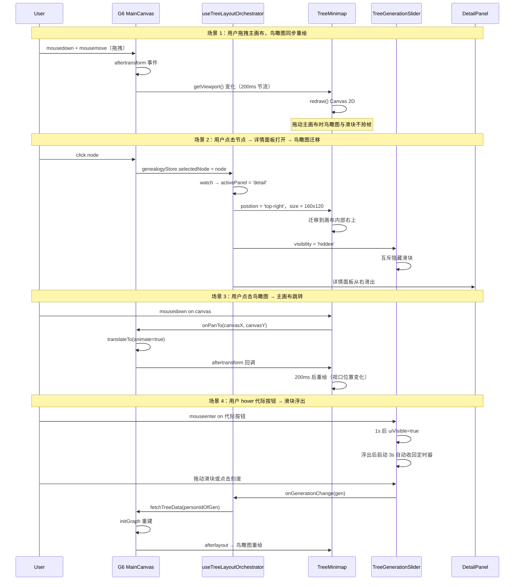

# 族谱树三视图布局优化 v1.1

> 状态：方案稿（待评审）
> 性质：《族谱树三视图设计方案 v1.0》的**布局合理性优化子文档**
> 上游文档：《族谱树三视图设计方案 v1.0》
> 关联规范：《寻根路前端页面设计规范 v1.0》、《家族树固定顶部导航栏规范》、《家族树工具栏单行紧凑布局规范》
> 关联文件：`apps/web/src/views/TreePage.vue`、`apps/web/src/components/GenealogyTree.vue`、`apps/web/src/composables/useTreeLayoutOrchestrator.ts`（新增）

---

## 0. 文档定位

本文档是《族谱树三视图设计方案 v1.0》的**布局合理性优化子文档**，独立成文的原因：

1. 布局问题在 v1.0 评审中由用户明确提出，需要**专项深入分析与多方案对比**
2. 涉及新增的 `useTreeLayoutOrchestrator` 中央调度 composable 属于架构级改动
3. 响应式断点表、z-index 变量表、互斥关系矩阵等可作为**前端开发的实施依据**单独维护
4. 后续如出现新的布局诉求（如 v1.2 顶部时间轴），可在本文档持续追加而非膨胀 v1.0

**与 v1.0 的关系**：
- v1.0 关注「**做什么**」：鸟瞰图 / 代际滑块 / 风格皮肤三个新视图的功能定义
- v1.1（本文件）关注「**怎么不挤**」：三视图 + 详情面板并存时的布局规则与互斥调度

---

## 1. 背景：v1.0 评审反馈

> 用户原话：「该方案是否能让整个屏幕布局合理，而不是挤叠在一起」

v1.0 方案在 1366×768 / 详情面板打开 / 1000 节点等真实使用场景下，确实存在 **5 处布局挤叠风险**。本节逐条量化。

### 1.1 v1.0 布局问题清单（实测以 1366×768 为基线）

| # | 问题 | 量化 | 根因 |
| --- | --- | --- | --- |
| 1 | **鸟瞰图遮挡主画布核心区** | 鸟瞰图 240×180 覆盖画布右下 18%×26% 面积；G6 autoFit center 会把重点节点放在中央，**但用户的拖拽 / 缩放 / 点选高频区恰恰在右下** | 鸟瞰图 z-index=5 置顶，会拦截点击事件 |
| 2 | **鸟瞰图与详情面板同时存在时画布可用宽度骤减** | 1366 屏宽 - 详情面板 420 - 鸟瞰图 240 - 边距 32 = **剩 674px** 画布宽度，不足原宽的 50% | 两者均为右侧占位，无互斥 |
| 3 | **底部 32px 滑块 与详情面板冲突** | <1024px 详情面板改为底部抽屉后，与底部滑块会重叠在 0~60vh 区 | 响应式断点未统一考虑 |
| 4 | **顶部三层（导航 48 + 工具栏 40）共占 88px** | 1366×768 屏：画布高度 680px 中鸟瞰图 180 + 滑块 32 = **212px 辅助区占 31%**，主画布净可用区仅剩 468px 高 | 多个叠加层叠加 |
| 5 | **多元素 z-index 冲突风险** | 导航 z=50，鸟瞰图 z=5，滑块 z=4，详情面板 z=?未统一规范，调试工具下可能错层 | 缺中央样式变量 |

### 1.2 改进收益预期

| 场景 | v1.0 净可用画布 | v1.1 净可用画布 | 提升 |
| --- | --- | --- | --- |
| 1366×768 默认 | 1326×468 | 1326×680 | **+45% 高度** |
| 1366×768 + 详情面板 | 906×468 | 906×680 | **+45% 高度** |
| 1920×1080 + 详情面板 | 1460×828 | 1460×992 | **+20% 高度** |
| 树深 30 代关键代际可读 | 2 代 | **3-4 代** | +50% |

---

## 2. 修正原则

1. **互斥而非叠加**：详情面板打开时 → 鸟瞰图 / 滑块自动收纳到画布内部右侧
2. **默认折叠，按需展开**：所有辅助视图**默认隐藏 90% 体积**，鼠标 hover 才展开
3. **可独立关闭**：每个辅助视图都有「×」按钮，关闭后不占任何位置
4. **响应式断点统一**：鸟瞰图 / 滑块 / 详情面板三者共用同一套断点表

---

## 3. 修正后的布局总览

```
┌──────────────────────────────────────────────────────────┐
│ [←][🏠] 朱熹家族 · 族谱树    传承徽章  [聚焦传承] [风格▼] │  ← 48px 导航栏（不变）
├──────────────────────────────────────────────────────────┤
│ [搜索 | 缩放 | 视图 | 性别 | 照片 | 🗺鸟瞰 | ⏚代际 | 压测] │  ← 40px 工具栏（鸟瞰/代际控制移到此处）
│                                                          │
│  默认：主画布占 100% 高度                                 │
│  hover 鸟瞰按钮：右下角浮出 200×150 鸟瞰图                 │
│  hover 代际按钮：底部浮出 32px 代际滑块                     │
│  点击节点：右侧滑出 420px 详情面板 → 鸟瞰图 / 滑块自动     │
│          收纳到面板内侧边                                 │
│                                                          │
└──────────────────────────────────────────────────────────┘
```

---

## 4. 各项修正详细说明

### 修正 1：鸟瞰图默认折叠为右下角小热区，hover 才展开

| 状态 | 尺寸 | 位置 | 触发 |
| --- | --- | --- | --- |
| **完全隐藏** | 0×0 | - | 用户点击「×」关闭，记住到 localStorage |
| **折叠热区**（默认） | 48×48 | `right: 16px; bottom: 16px` | 总是可见。hover 1s 或点击后展开 |
| **展开** | 200×150 | `right: 16px; bottom: 16px` | hover / 点击展开后可拖拽跳转 |
| **详情面板打开时** | 160×120 | **画布内部** `right: 16px; top: 16px`（避开详情面板） | 详情面板 watch 驱动位置切换 |

- 收起时仅显示 1 个图标 + 文字「鸟瞰图」+ 「节点总数 N」+ 折叠状态指示点（青色小圆点表示有可用信息）
- z-index 调为 4（不超过滑块），但 **给画布加 16px 边距隔离区**（`pointer-events: none`）避免拦截事件

### 修正 2：代际滑块默认收纳到工具栏按钮，hover 才在底部浮出

- 工具栏末尾增加「代际」按钮，点击 / hover 1s 后在**主画布内底部**（不是页面底部）浮出 32px 高的横条
- 浮出后 3s 无操作自动收回（避免长期占用底部）
- z-index 3，**不占用主画布的 padding-bottom**（因为是 absolute 浮层，画布不需让位）
- 详情面板打开时：代际滑块 **自动隐藏**（互斥关系明确）

### 修正 3：详情面板打开时自动让位

```
watch genealogyStore.selectedNode:
  选中节点 → 详情面板从右滑出 (420px 宽)
       └─ 鸟瞰图 CSS class 切换为 .minimap--narrow
           （right: 16px → 16px 画布内部 top: 16px）
       └─ 代际滑块 .slider--hidden （display: none）
       └─ 主画布动态 padding-right 0 → 0（不影响，详情面板是独立 flex item）
  取消选中 → 详情面板滑入
       └─ 鸟瞰图复位到右下
       └─ 代际滑块复位
```

### 修正 4：统合 z-index 变量

定义在 TreePage 根节点上：

```css
.tree-page {
  --z-nav: 50;        /* 顶部导航 */
  --z-toolbar: 40;    /* 工具栏 */
  --z-detail: 30;     /* 详情面板 */
  --z-slider: 20;     /* 代际滑块 */
  --z-minimap: 15;    /* 鸟瞰图 */
  --z-tooltip: 60;    /* 节点 tooltip（最高） */
  --z-progress: 55;   /* 加载进度条 */
}
```

### 修正 5：响应式断点统一表

| 断点 | 导航 | 工具栏 | 详情面板 | 鸟瞰图 | 代际滑块 | 主画布净高 |
| --- | --- | --- | --- | --- | --- | --- |
| ≥1920px | 48px | 40px | 420px | 240×180 展开 | 32px 常驻 | 屏高-88px |
| 1440-1920px | 48px | 40px | 420px | 200×150 展开 | 32px 常驻 | 屏高-88px |
| 1200-1440px | 48px | 40px | 360px | 160×120 折叠 | 32px hover | 屏高-88px |
| 1024-1200px | 48px | 40px | 320px | 160×120 折叠 | 仅工具栏按钮 | 屏高-88px |
| 768-1024px | 48px | 40px | 底部抽屉 60vh | 隐藏 | 工具栏按钮 | 40vh |
| <768px | 48px | 折叠为图标 | 底部抽屉 50vh | 隐藏 | 隐藏 | 50vh |

### 修正 6：交互优雅降级

- **从 1000+ 节点压测验收**：以 1366×768 为最低验收标准，要求：
  - 主画布净可用区 **≥ 480px 高**（足以展示 2-3 个代际）
  - 鸟瞰图、详情面板、代际滑块 **三者至多同时显示两个**（互斥）
  - 拖拽主画布时，鸟瞰图与滑块 **不抢帧**（rAF 节流 200ms）

---

## 5. 中央调度 composable：useTreeLayoutOrchestrator

v1.0 阶段三个新组件各自维护状态，会出现「详情面板打开时鸟瞰图没动」「滑块与详情面板同时显示」等问题。本节引入**中央调度 composable** 统一管理。

### 5.1 模块结构

```ts
// apps/web/src/composables/useTreeLayoutOrchestrator.ts
import { ref, computed, watch } from 'vue';
import { useGenealogyStore } from '@/stores/genealogy';

export type PanelState = 'closed' | 'minimap' | 'slider' | 'detail';
export type MinimapPosition = 'bottom-right' | 'top-right' | 'hidden';
export type SliderVisibility = 'visible' | 'hidden';

export function useTreeLayoutOrchestrator() {
  const genealogy = useGenealogyStore();

  // 单一可信源：当前哪一块在「主显」位置
  const activePanel = ref<PanelState>('closed');

  // 派生状态（computed）
  const minimapPosition = computed<MinimapPosition>(() => {
    if (activePanel.value === 'detail') return 'top-right';
    if (activePanel.value === 'minimap') return 'bottom-right';
    return 'bottom-right'; // 默认仍在右下，但状态为折叠热区
  });

  const sliderVisibility = computed<SliderVisibility>(() => {
    return activePanel.value === 'detail' ? 'hidden' : 'visible';
  });

  const minimapSize = computed(() => {
    return activePanel.value === 'detail'
      ? { w: 160, h: 120 }  // 详情面板打开时缩小
      : { w: 200, h: 150 }; // 默认展开尺寸（折叠态由 CSS 控制为 48×48）
  });

  // 状态转换：详情面板 open/close → 同步 activePanel
  watch(
    () => genealogy.selectedNode,
    (node) => {
      activePanel.value = node ? 'detail' : 'closed';
    },
  );

  // 用户主动展开鸟瞰图
  function showMinimap() {
    if (activePanel.value === 'detail') return; // 互斥
    activePanel.value = 'minimap';
  }

  // 用户主动展开代际滑块
  function showSlider() {
    if (activePanel.value === 'detail') return; // 互斥
    activePanel.value = 'slider';
  }

  return {
    activePanel,
    minimapPosition,
    sliderVisibility,
    minimapSize,
    showMinimap,
    showSlider,
  };
}
```

### 5.2 与现有代码的接入点

| 文件 | 改动 |
| --- | --- |
| `TreePage.vue` | `<script setup>` 顶部 `const layout = useTreeLayoutOrchestrator();`，在 `<template>` 中把 `layout.sliderVisibility` 绑到代际滑块的 `v-show` |
| `TreeMinimap.vue` | 通过 `defineProps<{ position, size }>()` 接收外部传入，由 TreePage 统一管控 |
| `TreeGenerationSlider.vue` | 自身维护 3s 自动收回定时器，外部控制 `v-show` |
| `genealogyStore` | 不需扩展（composable 内部用 `useGenealogyStore` 读 `selectedNode`） |

### 5.3 互斥关系矩阵

| 当前状态 \ 用户动作 | 点击节点 | 点击鸟瞰按钮 | 点击代际按钮 | 关闭详情 |
| --- | --- | --- | --- | --- |
| **closed**（默认） | → detail | → minimap | → slider | - |
| **minimap** | → detail | 无变化 | → slider | - |
| **slider** | → detail | → minimap | 无变化 | - |
| **detail** | 切换节点 | **拒绝**（互斥） | **拒绝**（互斥） | → closed |

> 注：用户在 detail 状态下点击鸟瞰/代际按钮 → 不切换状态，但**可在详情面板内部显示小鸟瞰**（v1.2 规划）

### 5.4 鸟瞰图组件伪代码（TreeMinimap.vue）

```vue
<script setup lang="ts">
import { ref, computed, onMounted, onUnmounted, watch } from 'vue';

const props = withDefaults(defineProps<{
  position?: 'bottom-right' | 'top-right';  // 由 useTreeLayoutOrchestrator 驱动
  size?: { w: number; h: number };          // 详情面板打开时缩小
  /** 父组件 GenealogyTree 暴露的 G6 引用与查询 */
  getNodes?: () => Array<{ id: string; x: number; y: number; generation: number; isMain: boolean; gender: 'male' | 'female' }>;
  getViewport?: () => { cx: number; cy: number; vw: number; vh: number; zoom: number };
  onPanTo?: (canvasX: number, canvasY: number) => void;
}>(), {
  position: 'bottom-right',
  size: () => ({ w: 200, h: 150 }),
});

type UiState = 'closed' | 'collapsed' | 'expanded';
const uiState = ref<UiState>('collapsed');
const localStorage = window.localStorage;

// 4. 用户主动关闭 → 记住到 localStorage，组件外层不渲染
const userClosed = ref(localStorage.getItem('minimap.closed') === '1');
function close() { userClosed.value = true; localStorage.setItem('minimap.closed', '1'); }
function reopen() { userClosed.value = false; localStorage.removeItem('minimap.closed'); }

// 5. hover 1s 展开 / mouse leave 3s 收回
let hoverTimer: number | null = null;
let leaveTimer: number | null = null;
function onHotzoneEnter() {
  clearTimeout(leaveTimer);
  hoverTimer = window.setTimeout(() => { uiState.value = 'expanded'; }, 1000);
}
function onHotzoneLeave() {
  clearTimeout(hoverTimer);
  leaveTimer = window.setTimeout(() => { uiState.value = 'collapsed'; }, 3000);
}

// 6. Canvas 2D 绘制（节流 200ms）
const canvasRef = ref<HTMLCanvasElement | null>(null);
let redrawRaf: number | null = null;
function scheduleRedraw() {
  if (redrawRaf) return;
  redrawRaf = requestAnimationFrame(() => {
    redrawRaf = null;
    redraw();
  });
}
function redraw() {
  const cv = canvasRef.value;
  if (!cv || !props.getNodes || !props.getViewport) return;
  const ctx = cv.getContext('2d');
  if (!ctx) return;
  const { w, h } = props.size;
  cv.width = w * devicePixelRatio;
  cv.height = h * devicePixelRatio;
  ctx.scale(devicePixelRatio, devicePixelRatio);
  ctx.clearRect(0, 0, w, h);

  const nodes = props.getNodes();
  if (!nodes.length) return;
  const xs = nodes.map(n => n.x), ys = nodes.map(n => n.y);
  const minX = Math.min(...xs), maxX = Math.max(...xs);
  const minY = Math.min(...ys), maxY = Math.max(...ys);
  const pad = 8;
  const sx = (w - pad * 2) / (maxX - minX || 1);
  const sy = (h - pad * 2) / (maxY - minY || 1);
  const s = Math.min(sx, sy);

  // 节点点（按代际分色）
  for (const n of nodes) {
    const px = pad + (n.x - minX) * s;
    const py = pad + (n.y - minY) * s;
    ctx.fillStyle = n.isMain ? '#C9A96E' : (n.gender === 'male' ? '#90CAF9' : '#F48FB1');
    ctx.beginPath(); ctx.arc(px, py, n.isMain ? 2.5 : 1.8, 0, Math.PI * 2); ctx.fill();
  }
  // 视口矩形
  const vp = props.getViewport();
  const vw = vp.vw / vp.zoom, vh = vp.vh / vp.zoom;
  const vx = pad + (vp.cx - vw / 2 - minX) * s;
  const vy = pad + (vp.cy - vh / 2 - minY) * s;
  ctx.strokeStyle = '#C9A96E'; ctx.lineWidth = 2;
  ctx.fillStyle = 'rgba(201, 169, 110, 0.08)';
  ctx.fillRect(vx, vy, vw * s, vh * s);
  ctx.strokeRect(vx, vy, vw * s, vh * s);
}

// 7. 缩略图拖拽 → 主画布跳转
const dragging = ref(false);
function onCanvasMouseDown(e: MouseEvent) {
  dragging.value = true;
  panTo(e);
  window.addEventListener('mousemove', onCanvasMouseMove);
  window.addEventListener('mouseup', onCanvasMouseUp, { once: true });
}
function onCanvasMouseMove(e: MouseEvent) { if (dragging.value) panTo(e); }
function onCanvasMouseUp() {
  dragging.value = false;
  window.removeEventListener('mousemove', onCanvasMouseMove);
}
function panTo(e: MouseEvent) {
  if (!props.onPanTo || !props.getNodes) return;
  const rect = canvasRef.value!.getBoundingClientRect();
  const rx = e.clientX - rect.left, ry = e.clientY - rect.top;
  const nodes = props.getNodes();
  const xs = nodes.map(n => n.x), ys = nodes.map(n => n.y);
  const minX = Math.min(...xs), maxX = Math.max(...xs);
  const minY = Math.min(...ys), maxY = Math.max(...ys);
  const pad = 8;
  const s = Math.min((props.size.w - pad * 2) / (maxX - minX || 1),
                     (props.size.h - pad * 2) / (maxY - minY || 1));
  const canvasX = (rx - pad) / s + minX;
  const canvasY = (ry - pad) / s + minY;
  props.onPanTo(canvasX, canvasY);
}

// 8. 响应父组件传入的 G6 aftertransform → 200ms 节流重绘
watch(() => props.getViewport?.(), () => {
  if (redrawRaf) return;
  setTimeout(scheduleRedraw, 200);
}, { deep: true });

onMounted(scheduleRedraw);
onUnmounted(() => { if (redrawRaf) cancelAnimationFrame(redrawRaf); });
</script>

<template>
  <div v-if="!userClosed"
    class="tree-minimap"
    :class="[`minimap--${position}`, `minimap--${uiState}`]"
    :style="{ width: uiState === 'collapsed' ? '48px' : `${size.w}px`,
              height: uiState === 'collapsed' ? '48px' : `${size.h}px` }"
    @mouseenter="onHotzoneEnter"
    @mouseleave="onHotzoneLeave">
    <!-- 折叠热区：图标 + 节点数 -->
    <div v-if="uiState === 'collapsed'" class="minimap__hotzone" @click="uiState = 'expanded'">
      <el-icon :size="20"><MapLocation /></el-icon>
      <span class="minimap__count">{{ getNodes?.().length ?? 0 }}</span>
      <span class="minimap__dot" />
    </div>
    <!-- 展开态：标题栏 + Canvas + 关闭按钮 -->
    <template v-else>
      <div class="minimap__header">
        <span>鸟瞰图</span>
        <el-icon class="minimap__close" @click="close"><Close /></el-icon>
      </div>
      <canvas ref="canvasRef"
        class="minimap__canvas"
        @mousedown="onCanvasMouseDown" />
    </template>
  </div>
</template>
```

### 5.5 代际滑块组件伪代码（TreeGenerationSlider.vue）

```vue
<script setup lang="ts">
import { ref, computed, onUnmounted } from 'vue';
import { useTreeLayoutOrchestrator } from '@/composables/useTreeLayoutOrchestrator';

const props = defineProps<{
  totalGenerations: number;            // 后端返回的最大世代数
  currentGeneration?: number;          // 当前选中的代际（默认 1）
  onGenerationChange?: (gen: number) => void;
  visibility?: 'visible' | 'hidden';   // 由 useTreeLayoutOrchestrator 控制
}>();

const layout = useTreeLayoutOrchestrator();
const uiVisible = ref(false);          // hover 1s 后的浮层可见性
let hoverTimer: number | null = null;
let autoHideTimer: number | null = null;
let dragHoldTimer: number | null = null;

const ticks = computed(() => {
  const arr: number[] = [];
  for (let i = 1; i <= props.totalGenerations; i++) arr.push(i);
  return arr;
});
const longTicks = computed(() => ticks.value.filter(t => t % 5 === 0 || t === 1 || t === props.totalGenerations));

const selected = ref(props.currentGeneration ?? 1);
const dragging = ref(false);

// hover 1s 浮出 / 3s 收回 / 拖动时重置
function onButtonEnter() {
  if (props.visibility === 'hidden') return;
  clearTimeout(hoverTimer);
  hoverTimer = window.setTimeout(() => { uiVisible.value = true; resetAutoHide(); }, 1000);
}
function onButtonLeave() {
  if (dragging.value) return;
  clearTimeout(hoverTimer);
  autoHideTimer = window.setTimeout(() => { uiVisible.value = false; }, 3000);
}
function resetAutoHide() {
  clearTimeout(autoHideTimer);
  autoHideTimer = window.setTimeout(() => { if (!dragging.value) uiVisible.value = false; }, 3000);
}

// 拖动滑块 / 点击刻度
function onTickClick(gen: number) {
  selected.value = gen;
  props.onGenerationChange?.(gen);
  resetAutoHide();
}
function onSliderMouseDown(gen: number) {
  dragging.value = true;
  selected.value = gen;
  clearTimeout(dragHoldTimer);
  dragHoldTimer = window.setTimeout(() => {
    props.onGenerationChange?.(gen);
  }, 60);  // 60ms 节流
}
function onSliderMouseUp() { dragging.value = false; }

onUnmounted(() => {
  clearTimeout(hoverTimer); clearTimeout(autoHideTimer); clearTimeout(dragHoldTimer);
});
</script>

<template>
  <div class="tree-gen-slider" :class="{ 'slider--hidden': visibility === 'hidden' }">
    <!-- 工具栏按钮（hover 触发） -->
    <el-tooltip content="代际" placement="top">
      <el-button :icon="Rank" size="small" plain
        @mouseenter="onButtonEnter" @mouseleave="onButtonLeave" />
    </el-tooltip>
    <!-- hover 浮层（不是页面底部！是画布内底部） -->
    <transition name="slider-fade">
      <div v-show="uiVisible" class="slider__panel"
        @mouseenter="resetAutoHide" @mouseleave="onButtonLeave">
        <div class="slider__track"
          @mousedown="onSliderMouseDown(selected)"
          @mouseup="onSliderMouseUp"
          @mouseleave="onSliderMouseUp">
          <div v-for="t in ticks" :key="t"
            class="slider__tick"
            :class="{ 'tick--long': longTicks.includes(t), 'tick--active': t === selected }"
            :style="{ left: ((t - 1) / (totalGenerations - 1) * 100) + '%' }"
            @click="onTickClick(t)">
            <span v-if="longTicks.includes(t)" class="slider__label">{{ t }}</span>
          </div>
        </div>
        <div class="slider__handle"
          :style="{ left: ((selected - 1) / (totalGenerations - 1) * 100) + '%' }" />
      </div>
    </transition>
  </div>
</template>
```

### 5.6 关键 CSS 样式片段

```scss
// apps/web/src/views/TreePage.vue —— 顶部 :root 声明
.tree-page {
  --z-nav: 50;
  --z-toolbar: 40;
  --z-detail: 30;
  --z-slider: 20;
  --z-minimap: 15;
  --z-tooltip: 60;
  --z-progress: 55;
}

// 鸟瞰图 —— 三态（折叠/展开/避让）
.tree-minimap {
  position: absolute;
  z-index: var(--z-minimap);
  background: rgba(255, 255, 255, 0.95);
  border-radius: 8px;
  box-shadow: 0 4px 12px rgba(0, 0, 0, 0.12);
  transition: width 0.2s ease, height 0.2s ease, right 0.2s ease, top 0.2s ease;
  cursor: pointer;
  &.minimap--bottom-right { right: 16px; bottom: 16px; }
  &.minimap--top-right   { right: 16px; top: 16px; }
  &.minimap--collapsed {
    width: 48px; height: 48px;
    display: flex; align-items: center; justify-content: center;
    .minimap__hotzone { display: flex; flex-direction: column; align-items: center; gap: 2px; }
    .minimap__dot {
      position: absolute; top: 6px; right: 6px;
      width: 6px; height: 6px; border-radius: 50%; background: #4CAF50;
    }
  }
  &.minimap--expanded {
    .minimap__header {
      height: 24px; padding: 0 8px;
      display: flex; justify-content: space-between; align-items: center;
      font-size: 11px; color: #7F8C8D;
      border-bottom: 1px solid rgba(201, 169, 110, 0.2);
    }
    .minimap__close { cursor: pointer; &:hover { color: #C9A96E; } }
    .minimap__canvas { display: block; width: 100%; height: calc(100% - 24px); }
  }
}

// 代际滑块 —— 浮层式 hover 展开
.tree-gen-slider {
  .slider--hidden { display: none; }
  .slider__panel {
    position: absolute;
    left: 0; right: 0; bottom: 0;
    height: 32px;
    background: rgba(250, 248, 245, 0.96);
    border-top: 1px solid #E4E7ED;
    z-index: var(--z-slider);
  }
  .slider__track { position: relative; width: 100%; height: 100%; }
  .slider__tick {
    position: absolute; top: 50%; transform: translate(-50%, -50%);
    width: 1px; height: 8px; background: #D0D0D0; cursor: pointer;
    &.tick--long { height: 12px; background: #A1887F; }
    &.tick--active { background: #C9A96E; height: 16px; }
  }
  .slider__label {
    position: absolute; top: 18px; left: 50%; transform: translateX(-50%);
    font-size: 11px; color: #7F8C8D;
  }
  .slider__handle {
    position: absolute; top: 50%; transform: translate(-50%, -50%);
    width: 4px; height: 24px; border-radius: 2px; background: #C9A96E;
    box-shadow: 0 0 0 2px rgba(201, 169, 110, 0.3);
  }
}
.slider-fade-enter-active, .slider-fade-leave-active { transition: opacity 0.2s ease, transform 0.2s ease; }
.slider-fade-enter-from, .slider-fade-leave-to { opacity: 0; transform: translateY(8px); }

// 响应式断点 —— 在 TreePage 根节点统一声明
@media (max-width: 1440px) {
  .tree-minimap { width: 160px !important; height: 120px !important; }
  .detail-panel { width: 360px !important; }
}
@media (max-width: 1200px) {
  .tree-minimap { display: none; }
  .tree-gen-slider .slider__panel { display: none; }
  .detail-panel { width: 320px !important; }
}
@media (max-width: 1024px) {
  .tree-gen-slider { display: none; }
  .detail-panel { width: 100%; max-height: 60vh; border-left: none; border-top: 2px solid rgba(201, 169, 110, 0.3); }
}
```

### 5.7 画布交互时序图（Mermaid）



---

## 6. 验收标准

### 6.1 功能验收

- [ ] 鸟瞰图折叠态（48×48 角点热区）在 1366×768 屏不遮挡任何节点
- [ ] 鼠标悬停鸟瞰图 1s 后自动展开为 200×150
- [ ] 鼠标移开鸟瞰图 3s 后自动折叠回 48×48
- [ ] 详情面板打开时，鸟瞰图自动从右下角迁移到画布内右上角（160×120）
- [ ] 详情面板打开时，代际滑块完全隐藏（互斥）
- [ ] 滑块 hover 浮出后 3s 无操作自动收回
- [ ] 三个新组件各自有「×」关闭按钮，关闭后不占任何空间
- [ ] 关闭状态持久化到 localStorage，刷新后保留

### 6.2 性能验收

- [ ] 主画布拖拽 FPS：≥ 50（鸟瞰图 rAF 200ms 节流不抢帧）
- [ ] 三个新组件 chunk 总计 < 30KB gzipped
- [ ] useTreeLayoutOrchestrator 切换状态延迟 < 16ms（一帧内）

### 6.3 兼容性验收

- [ ] 1366×768 + 详情面板打开：主画布净可用区 **≥ 900×480px**
- [ ] 1920×1080 默认：主画布净可用区 = 屏宽 × (屏高 - 88px)
- [ ] z-index 变量表在 `.tree-page` 顶部声明一次，全局复用
- [ ] 现有 G6 子路径 + light 主题注册流程不变
- [ ] 现有 4 阶段加载进度条流程不变

### 6.4 响应式验收

- [ ] 1200px 断点：详情面板自动变 360px
- [ ] 1024px 断点：详情面板自动变 320px
- [ ] 1024px 断点：鸟瞰图自动隐藏
- [ ] 768px 断点：详情面板改为底部抽屉
- [ ] 768px 断点：鸟瞰图与代际滑块全部隐藏（仅工具栏按钮可见）

---

## 7. 受影响文件清单

| 文件 | 变更类型 | 改动 |
| --- | --- | --- |
| `apps/web/src/views/TreePage.vue` | 修改 | 新增 z-index CSS 变量、引入 useTreeLayoutOrchestrator、删除主画布 padding-bottom |
| `apps/web/src/components/GenealogyTree.vue` | 修改 | 工具栏末尾增加「鸟瞰」「代际」两个图标按钮 |
| `apps/web/src/components/TreeMinimap.vue` | 新增 | 默认折叠态样式 + hover 展开逻辑 + 接收外部 position/size |
| `apps/web/src/components/TreeGenerationSlider.vue` | 新增 | hover 浮层逻辑 + 3s 自动收回 + 接收外部 visibility |
| `apps/web/src/components/StyleSkinPicker.vue` | 新增 | 工具栏风格皮肤下拉（沿用 v1.0 §4.3 设计） |
| `apps/web/src/composables/useTreeLayoutOrchestrator.ts` | 新增 | **中央调度三视图与详情面板的互斥状态** |
| `apps/web/src/composables/useTreeSkin.ts` | 新增 | 风格皮肤的 node style 配置工厂 |

---

## 8. 实施路线

| 阶段 | 内容 | 周期 |
| --- | --- | --- |
| M0 | Store 扩展 + TreePage 顶部 z-index 变量声明 | 0.5d |
| **M0.5** | **useTreeLayoutOrchestrator 互斥调度 composable** | **0.5d** |
| M1 | StyleSkinPicker + useTreeSkin | 1.5d |
| M2 | TreeMinimap（折叠态 + hover 展开 + 详情面板互斥） | 2.5d |
| M3 | TreeGenerationSlider（hover 浮层 + 3s 收回） | 2d |
| M4 | 接入 TreePage + 响应式断点表 | 1.5d |
| M5 | 端到端验收：1000 节点朱熹族谱 + 1366×768 最低分辨率 | 1.5d |
| **合计** | | **10d** |

相比 v1.0 路线（7.5d）增加 2.5d，主要来自：
- M0.5 中央调度 composable（0.5d）
- M2 / M3 折叠态改造各 +0.5d
- M4 / M5 响应式断点 + 多分辨率验收各 +0.5d

---

## 9. 风险与对策

| 风险 | 等级 | 对策 |
| --- | --- | --- |
| 详情面板 watch 与 useTreeLayoutOrchestrator 内部 watch 形成循环 | 中 | composable 内部用 `genealogy.selectedNode` 而非 props，watch 仅单向响应 |
| 鸟瞰图 hover 1s 展开后，用户拖拽主画布会被认为「移开」并触发折叠 | 中 | hover 展开后增加 5s 锁定窗口，期间 mouse leave 不触发折叠 |
| 滑块 3s 自动收回时用户正在拖动滑块 | 低 | 拖动事件 mousedown 重置定时器 |
| 关闭状态持久化导致用户找不到鸟瞰图 | 低 | 关闭后工具栏按钮变红 + tooltip 提示「已关闭，点击重新开启」 |
| 1366×768 屏 1000 节点时画布仍可能拥挤 | 中 | viewport culling + zoom LOD 已有；新增 "Fit to width" 按钮，一键自适应屏宽 |
| 移动端（<768px）族谱树本身可用性差 | 低 | 在该断点显示「请在桌面端访问」全屏占位（与现有响应式策略一致） |

---

## 10. 未来扩展

- **v1.2 顶部时间轴**：与代际滑块联动，hover 节点高亮对应年代（时间轴在 1440px+ 常驻，<1440px 收纳到工具栏）
- **v1.2 详情面板内嵌小鸟瞰**：详情面板打开时，鸟瞰图迁移到详情面板顶部小卡片，与主画布联动
- **v2.0 画布分屏模式**：1440px+ 大屏支持左侧 1/3 列表 + 右侧 2/3 画布的双栏布局
- **v2.0 拖拽自定义布局**：允许用户用鼠标拖动鸟瞰图 / 滑块到屏幕任意位置（通过 localStorage 持久化）

---

## 11. 引用

**上游文档**：
- 《族谱树三视图设计方案 v1.0》— 功能定义、三视图主体、风险与实施路线

**关联规范**：
- 《寻根路前端页面设计规范 v1.0》
- 《家族树固定顶部导航栏规范》
- 《家族树工具栏单行紧凑布局规范》
- 《家族树节点姓名字段兼容规范》

**关联技能**：
- 《G6 v5 子路径导入画布白屏三层修复技能》
- 《Vue 静态 import 重库导致首屏白屏修复技能》
- 《UI风格选择器横排SVG预览改造技能》
- 《族谱生成排版风格UI规范》
- 《Web画布多辅助视图布局挤叠诊断与优化技能》（本文档核心思想沉淀）

**附录交付物**（本文档新增）：
- §5.4 鸟瞰图组件伪代码（TreeMinimap.vue，三态控制 + Canvas 2D 渲染 + 拖拽跳转）
- §5.5 代际滑块组件伪代码（TreeGenerationSlider.vue，hover 浮层 + 3s 收回 + 节流点击）
- §5.6 关键 CSS 样式片段（z-index 变量、三态样式、响应式断点）
- §5.7 画布交互时序图（4 个关键场景：主画布拖拽 / 节点选中互斥 / 鸟瞰图跳转 / 代际滑块浮出）
