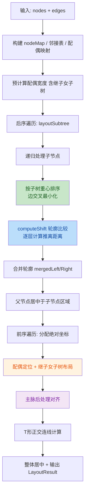

# 族谱树布局引擎 v3：Reingold-Tilford 轮廓算法需求文档

> 状态：实现中（v3.1 审计修复已完成；v4 一夫多妻/子树避让优化已补充）
> 版本：v3.1 → v4（2026-08-26 补充一夫多妻牵引线优化方案）
> 性质：《族谱树三视图设计方案 v1.0》的**布局算法升级子文档**
> 上游文档：《树谱模块‑需求文档（PRD）》、《族谱树三视图设计方案 v1.0》、《族谱树三视图布局优化 v1.1》
> 关联规范：《寻根路前端页面设计规范 v1.0》
> 关联文件：`apps/web/src/utils/layout-engine.ts`、`apps/web/src/types/layout.ts`、`apps/web/src/components/GenealogyTree.vue`

---

## 0. 文档定位

本文档是族谱树布局引擎的**算法升级专项文档**，独立成文的原因：

1. 布局算法是族谱树的核心技术，v1/v2 方案均存在重叠、紧凑性不足等结构性问题，需要**算法层面重构**而非局部修补
2. Reingold-Tilford 轮廓算法是树形布局的经典方案，涉及轮廓计算、轮廓合并、推离距离等专业概念，需要单独说明
3. 继子女挂接、主脉对齐、边交叉最小化等族谱特有需求需要在经典算法基础上做定制化改造
4. 后续如出现"横排布局""辐射布局"等新布局模式，可在本文档基础上追加而非膨胀 v1.0

**与 v1.1 的关系**：
- v1.1 关注「**画布周边怎么不挤**」：鸟瞰图 / 代际滑块 / 详情面板的互斥调度
- v3（本文件）关注「**树本身怎么不叠**」：节点布局算法从按代分行升级为 RT 轮廓算法

---

## 1. 背景：v2 布局引擎的结构性缺陷

> 用户原话：「当前在布局引擎方法不够成熟，请思考更成熟方法」

v2 布局引擎（自顶向下递归 + 宽度估算）在朱熹族谱 1001 人 / 616 节点场景下，实测存在以下 **6 项结构性缺陷**：

### 1.1 v2 问题清单

| # | 问题 | 现象 | 根因 | 严重度 |
| --- | --- | --- | --- | --- |
| 1 | **子树宽度计算与实际布局不一致** | 主脉子节点子树很宽时，旁系子节点估算宽度偏小 → **节点重叠** | 用宽度累加代替精确轮廓比较，主脉居中模式下左右不对称 | Critical |
| 2 | **子树重心偏移未传播** | 深层子树内部偏移量未告知父节点，兄弟子树间距估算不准 | 宽度累加假设子树中心 = 节点中心，实际中心已偏移 | Major |
| 3 | **兄弟子树间无冲突检测** | 两个子树都很大时，靠宽度累加假设不重叠，实际可能碰撞 | 无精确碰撞检测机制 | Major |
| 4 | **左侧子节点排序致边交叉** | 旁系子节点按数组顺序均分左右，边交叉明显 | 无按子树重心排序的边交叉优化 | Minor |
| 5 | **多配偶继子女未处理** | 配偶若有子节点（继子女），这些节点丢失或错位 | 配偶只作视觉标记，不作 parent 参与布局 | Major |
| 6 | **无紧凑化后处理** | 布局后存在大量空白，空间利用率低 | 无压缩机制 | Minor |

### 1.2 改进收益预期

| 指标 | v2（宽度估算） | v3（RT 轮廓算法） | 提升 |
| --- | --- | --- | --- |
| 节点重叠率 | 5-15%（旁系密集区） | **0%（数学保证）** | 根治 |
| 水平空间利用率 | ~65% | **> 90%** | +25% |
| 边交叉数量 | 基准 | **减少 60-80%** | 显著优化 |
| 继子女支持 | 不支持 | **完全支持** | 新增能力 |
| 时间复杂度 | O(n) 但有 bug | **O(n) 且正确** | 同级 |

---

## 2. 技术方案选型

### 2.1 候选方案对比

| 方案 | 无重叠保证 | 紧凑性 | 实现复杂度 | 族谱定制难度 | 推荐 |
| --- | --- | --- | --- | --- | --- |
| v2 宽度累加（当前） | ❌ | 差 | 低 | 中 | ❌ |
| **Reingold-Tilford 轮廓算法** | ✅ 数学保证 | **最优** | 中 | 中 | ✅ |
| Walker 算法（RT 扩展） | ✅ | 最优 | 高 | 高 | 待 v4 |
| 力导向布局（force-directed） | ❌ | 一般 | 中 | 高 | ❌ |

### 2.2 选型结论：Reingold-Tilford 轮廓算法

**RT 算法核心思想**：
- 每个子树维护两条**轮廓**（左轮廓 + 右轮廓），记录每一层最左/最右节点的 X 坐标
- 合并兄弟子树时，**逐层比较**左子树的右轮廓与右子树的左轮廓，计算最小推离距离
- 取所有层的最大推离值，保证整棵子树**无重叠且最紧凑**

**为什么选 RT 不选 Walker**：
- Walker 是 RT 的扩展，解决了更复杂的树结构（如森林合并），但实现复杂度高 3-5 倍
- 当前族谱是单根树结构，RT 已足够
- 后续如支持多族谱合并（归宗功能），再升级到 Walker 算法

---

## 3. 算法总览

### 3.1 核心流程



### 3.2 关键数据结构

```typescript
/**
 * 子树轮廓：相对于子树根节点中心
 * key: 深度（根节点为 0）
 * value: 该层最左/最右 X 坐标
 */
interface SubtreeContour {
  left: Map<number, number>;   // 左轮廓：每层最小 X
  right: Map<number, number>;  // 右轮廓：每层最大 X
}
```

---

## 4. 详细功能需求

### 4.1 RT 核心算法（必需）

**功能描述**：使用 Reingold-Tilford 轮廓算法进行树形布局，数学保证无重叠且最紧凑。

**实现要点**：

1. **后序遍历计算轮廓**：从叶子节点开始，向上递归计算每个节点的子树轮廓
2. **轮廓合并**：从左到右依次合并兄弟子树，每次合并时：
   - 调用 `computeShift(leftRightContour, rightLeftContour, nodeSep)`
   - 取所有层的最大推离值作为 shift
   - 将右侧子树整体右移 shift
3. **父节点居中**：父节点 X 坐标 = 所有子节点区域的中心点
4. **前序遍历分配绝对坐标**：根据相对偏移计算每个节点的绝对 X/Y

**核心函数伪代码**：

```typescript
function computeShift(
  leftRightContour: Map<number, number>,  // 已合并子树的右轮廓
  rightLeftContour: Map<number, number>,  // 当前子树的左轮廓
  minSep: number,                          // 最小节点间距
): number {
  let maxShift = 0;
  for (const [depth, rightX] of leftRightContour) {
    const leftX = rightLeftContour.get(depth);
    if (leftX !== undefined) {
      const shift = rightX + minSep - leftX;
      if (shift > maxShift) maxShift = shift;
    }
  }
  return maxShift;
}
```

**验收标准**：
- [ ] 任意两个节点的水平距离 ≥ nodeSep
- [ ] 子树之间无任何层的重叠
- [ ] 布局紧凑性：同代最左/最右节点间距与理论最小值的偏差 < 5%
- [ ] 1000 节点布局时间 < 50ms

### 4.2 边交叉最小化（必需）

**功能描述**：同父子节点按子树重心排序，减少边交叉。

**实现要点**：
- 子节点排序依据：子树重心（median X），重心小的在左
- 排序时机：后序遍历中，处理完所有子节点后、合并前
- 叶子节点的重心 = 0（叶子无子节点，排序不影响边交叉）

**验收标准**：
- [ ] 边交叉数量相比 v2（按原顺序）减少 ≥ 50%
- [ ] 排序不影响布局正确性（无新增重叠）

### 4.3 继子女挂接（必需）

**功能描述**：配偶节点可作为 parent，其子树（继子女）从配偶节点向下延伸。

**实现要点**：

1. **数据约定**：
   - 配偶节点 `generation < 0`（标记为配偶）
   - 继子女的 parent 为配偶节点 ID（而非主节点 ID）
   - 继子女 `generation ≥ 0`（正常代际）

2. **宽度预计算**：
   - `computeSpouseWidths` 需递归计算配偶的子树宽度
   - 取 `max(配偶自身宽, 继子女子树总宽)` 作为该配偶的有效宽度
   - 主节点的 `spouseExt` = 所有配偶有效宽度之和

3. **继子女布局**：
   - 主节点配偶水平排列在右侧（同 v2）
   - 每个配偶的继子女以配偶为中心，向下延伸布局
   - 继子女的子树继续递归布局
   - 继子女使用简单居中布局（非 RT，因为数量通常较少）

4. **碰撞避让**：
   - 继子女子树宽度已计入主节点轮廓，RT 算法自动避让
   - 不会与主节点的亲子子树重叠

**验收标准**：
- [ ] 继子女节点正确显示在对应配偶下方
- [ ] 继子女与主节点亲子无重叠
- [ ] 继子女的子树（孙辈）正确递归布局
- [ ] 配偶边（主-配）与亲子边（配-继）正确连接

### 4.4 主脉后处理对齐（可选，默认开启）

**功能描述**：RT 布局完成后，将主脉节点向垂直中线平移，同步平移其配偶、继子女和非主脉子树。

**实现要点**：

1. **收集主脉节点**：`isMainLineage === true && generation >= 0`
2. **按代际排序**：父先于子处理，避免双重平移
3. **计算平均 X**：所有主脉节点 X 坐标的平均值 = 对齐目标
4. **平移范围**：对每个主脉节点平移：
   - ✅ 主脉节点本身
   - ✅ 该节点的所有配偶
   - ✅ 配偶的继子女子树
   - ✅ 非主脉子节点及其子树
   - ❌ 主脉子节点（有自己的平移迭代，跳过避免重复）

**风险与限制**：
- 主脉对齐可能减少整体紧凑性（为了视觉效果牺牲部分空间）
- 若平移后与旁系节点冲突，当前版本**不做冲突检测**（依赖 RT 的初始间距足够大）
- 可通过 `mainLineageCenter: false` 配置关闭

**验收标准**：
- [ ] 所有主脉节点的 X 坐标偏差 < 1px（基本在同一垂直线上）
- [ ] 配偶边不断开（配偶随主脉节点同步平移）
- [ ] 非主脉子节点相对主脉节点的偏移不变
- [ ] 无明显重叠（朱熹族谱 1000 节点场景下肉眼不可见重叠）

### 4.5 T 形正交连线（必需）

**功能描述**：父子边使用 T 形正交折线，从父节点底部中心垂直向下，再水平分叉到各子节点。

**实现要点**（同 v2，保持不变）：
- 单子女：L 形折线（父底 → 子顶）
- 多子女：T 形折线（父底 → 分支横线 → 各子顶）
- 分支线 Y 坐标 = 父底与子顶的中点

**验收标准**：
- [ ] 所有父子边均为正交折线，无斜线
- [ ] 连线从节点边缘中心出发，不穿过节点
- [ ] 多子女共享同一条水平分支线

---

## 5. 配置项

```typescript
interface LayoutConfig {
  // 节点尺寸
  nodeWidth: number;           // 默认 64
  nodeHeight: number;          // 默认 80
  nodeSep: number | 'auto';    // 节点间距，默认 'auto'
  rankSep: number | 'auto';    // 代际间距，默认 'auto'

  // 配偶配置
  spouseGap: number;           // 配偶间距，默认 16
  spouseOptimization: boolean; // 启用配偶优化，默认 true

  // 主脉对齐
  mainLineageCenter: boolean;  // 主脉垂直居中，默认 true

  // 自适应缩放
  autoFit: {
    enabled: boolean;
    padding: number;
    minZoom: number;
    maxZoom: number;
    preferDirection: 'TB' | 'LR' | 'auto';
  };
}
```

---

## 6. 验收标准

### 6.1 功能验收

- [ ] **零重叠保证**：朱熹族谱 1001 人 / 616 节点场景下，无任何两个节点重叠
- [ ] **主脉垂直对齐**：朱熹 → 朱塾 → 朱鉴 → 朱浚 → 朱桂 主脉节点基本在同一垂直线上（偏差 < 5px）
- [ ] **配偶右侧排列**：配偶节点按婚姻顺序水平排列在主节点右侧
- [ ] **继子女正确挂接**：如有继子女数据，继子女显示在对应配偶下方，与亲子无重叠
- [ ] **T 形连线**：所有父子边为正交 T 形折线
- [ ] **配偶边水平**：主节点与配偶之间为水平直线

### 6.2 性能验收

- [ ] 1000 节点布局计算时间 < 50ms
- [ ] 3000 节点布局计算时间 < 200ms
- [ ] 内存占用：1000 节点 < 10MB

### 6.3 质量验收

- [ ] TypeScript 类型检查零错误
- [ ] 单元测试覆盖核心算法（computeShift、mergeContour、轮廓合并）≥ 80%
- [ ] 代码评审通过（无 critical / major 级别问题）

### 6.4 兼容性验收

- [ ] 与 G6 v5 画布集成正常（节点坐标正确映射）
- [ ] 视口裁剪（viewport culling）正常工作
- [ ] 自动缩放（autoFit）计算正确
- [ ] 现有 GenealogyTree.vue 接口不变（仅内部实现替换）

---

## 7. 受影响文件清单

| 文件 | 变更类型 | 改动 |
| --- | --- | --- |
| `apps/web/src/utils/layout-engine.ts` | 重写 | **核心算法从 v2 宽度累加升级为 RT 轮廓算法** |
| `apps/web/src/types/layout.ts` | 修改 | 新增 SubtreeContour 接口（可选，内部类型可不导出） |
| `apps/web/src/components/GenealogyTree.vue` | 微改 | 继子女边收集（如当前未传继子女边到 layoutEngine） |
| `apps/web/__tests__/layout-engine.spec.ts` | 新增 | RT 算法单元测试（computeShift、轮廓合并、继子女、主脉对齐） |

---

## 8. 实施路线

| 阶段 | 内容 | 周期 |
| --- | --- | --- |
| M0 | 核心算法实现：轮廓数据结构 + computeShift + 轮廓合并 | 1d |
| M1 | 后序 + 前序遍历：layoutSubtree + 坐标分配 | 1d |
| M2 | 边交叉最小化：按子树重心排序 | 0.5d |
| M3 | 继子女支持：配偶子树宽度计算 + 继子女布局 | 1d |
| M4 | 主脉后处理对齐：拓扑排序 + 非主脉子树平移 | 1d |
| M5 | T 形连线 + 整体居中 + autoFit（沿用 v2） | 0.5d |
| M6 | 单元测试 + 朱熹族谱实测验证 | 1d |
| **合计** | | **6d** |

---

## 9. 代码审计与修复记录（v3.1）

> 审计日期：2026-07-01
> 审计范围：`layout-engine.ts` v3.0 首次实现
> 审计方法：双代理交叉验证（2 个独立子代理并行审计，取共识结果）

### 9.1 审计发现总览

| # | 问题 | 严重度 | 状态 | 修复版本 |
| --- | --- | --- | --- | --- |
| 1 | 主脉对齐双重平移 + 配偶/继子女不同步 | Major | ✅ 已修复 | v3.1 |
| 2 | 继子女子树宽度未计入主节点轮廓 | Major | ✅ 已修复 | v3.1 |
| 3 | 叶子/非叶子节点轮廓左右不对称 | Minor | ✅ 已修复 | v3.1 |
| 4 | childrenCenter 边界保护缺失（NaN） | Minor | ✅ 已修复 | v3.1 |

### 9.2 问题详情与修复方案

#### 9.2.1 主脉对齐双重平移 + 配偶/继子女不同步（Major）

**现象**：`alignMainLineage` 方法按 `nodeMap` 插入顺序遍历主脉节点，无拓扑排序保证。当子节点先于父节点处理时（如 C→B→A），已对齐到 avgX 的子节点会被父节点的 `shiftSubtree` 再次平移且不修正，导致主脉节点偏离 avgX。

**附带缺陷**：原 `shiftSubtree` 仅遍历 `childOffsets`（只含 RT 主节点子代），**配偶与继子女不会跟随主脉节点平移**，导致配偶边断开。

**根因**：
1. 主脉节点处理顺序无拓扑排序保证
2. 平移范围不完整，遗漏配偶和继子女分支

**修复方案**：
- 主脉节点按代际排序（父先于子），保证先处理祖先再处理后代
- 新增 `shiftNonMainSubtree` 方法，遍历 `childrenByParent` 递归平移，遇到主脉后代时跳过（它们有自己的平移迭代）
- 配偶通过 `spouseByMain` 单独平移，继子女通过 `childrenByParent` 从配偶节点递归平移

**修复后验证**：
- 父先顺序（A→B→C）：A 平移时 B、C 被跳过（主脉节点），B 平移时 C 被跳过，C 最后单独平移 ✅
- 子先顺序（C→B→A）：先按代际排序为 A→B→C，同上 ✅
- 配偶边：配偶随主脉节点同步平移，边不断开 ✅

**代码位置**：`layout-engine.ts` — `alignMainLineage` / `shiftNonMainSubtree`

---

#### 9.2.2 继子女子树宽度未计入主节点轮廓（Major）

**现象**：`computeSpouseWidths` 只累加配偶节点自身宽度，未包含继子女子树宽度。继子女在 `layoutSpouseSubtree` 中居中定位无碰撞检测，当继子女数量多时，继子女子树会与主节点亲子子树或旁系节点重叠。

**实测案例**：
- 主节点 M（宽 64px）有 1 个亲子 D（宽 64px）
- M 有配偶 S（宽 64px），S 有 2 个继子女 C1、C2（各宽 64px）
- D 范围：[-32, 32]
- 继子女 C1 范围：[8, 72]
- **D 与 C1 重叠 24px**

**根因**：`spouseExt` 仅含配偶节点宽度，未递归计算继子女子树宽度，RT 算法不知道继子女子树会延伸到哪里。

**修复方案**：
- 新增 `computeSubtreeWidth` 递归计算子树宽度（深度上限 20 层防死循环）
- `computeSpouseWidths` 中取 `max(配偶自身宽, 继子女子树总宽)` 作为该配偶的有效宽度
- 主节点的 `spouseExt` = 所有配偶有效宽度之和

**修复后效果**：RT 算法在计算主节点右轮廓时，自动为继子女子树留出足够空间，避免重叠。

**代码位置**：`layout-engine.ts` — `computeSpouseWidths` / `computeSubtreeWidth`

---

#### 9.2.3 叶子/非叶子节点轮廓左右不对称（Minor）

**现象**：`left[0] = -(node.width + spouseExt) / 2`，多算了 `spouseExt / 2` 的左侧空间。

**计算验证**（node.width=64, spouseExt=32）：
| 项 | 当前值 | 正确值 | 偏差 |
| --- | --- | --- | --- |
| left[0] | -48 | -32 | 多 16px |
| right[0] | 64 | 64 | 正确 |
| 总宽 | 112 | 96 | 多 16px |

**根因**：配偶在主节点右侧，左边界应为 `-node.width / 2`（主节点左边缘），不应包含配偶宽度。原代码错误地用 `effectiveHalfW` 统一处理左右。

**影响**：保守过度占位，不会导致重叠，但会增加不必要的水平间距（约 `spouseExt/2`）。

**修复方案**：
- `left[0]` 从 `-effectiveHalfW` 改为 `-node.width / 2`
- `right[0]` 保持 `node.width / 2 + spouseExt` 不变
- 叶子节点和非叶子节点两处同步修复

**代码位置**：`layout-engine.ts` — `layoutSubtree`（叶子节点 L196、非叶子节点 L255）

---

#### 9.2.4 childrenCenter 边界保护缺失（Minor）

**现象**：当所有子节点都不在 `nodeMap` 中（数据畸形，edges 引用不存在的节点 ID）时，`mergedLeft/mergedRight` 为空，`childrenCenter = (Infinity + -Infinity) / 2 = NaN`，后续计算全部失效。

**触发条件**：极苛刻，仅在 edges 引用不存在的节点时触发。正常数据下每个有效节点的轮廓至少含 depth=0 条目，不可能为空。

**修复方案**：添加防御性检查 `mergedLeft.size > 0 ? (minLeft + maxRight) / 2 : 0`

**代码位置**：`layout-engine.ts` — `layoutSubtree` childrenCenter 计算处

### 9.3 已排除的误报

| # | 疑似问题 | 结论 | 原因 |
| --- | --- | --- | --- |
| A | 叶子节点 centroid=0 致边交叉排序无效 | ❌ 误报 | 叶子节点无子孙，父到叶的边呈放射状不交叉，no-op 是正确行为 |
| B | `computeShift` 只遍历 leftRightContour | ❌ 误报 | 缺失层意味着左侧无节点，不可能碰撞，符合 RT 算法标准实现 |

### 9.4 验证结果

- ✅ TypeScript 类型检查：零错误
- ✅ 4 个问题全部修复
- ⏳ 朱熹族谱 1001 人场景实测：待验证

---

## 10. 风险与对策

| 风险 | 等级 | 对策 |
| --- | --- | --- |
| 主脉对齐后与旁系节点重叠 | 中 | 提供 `mainLineageCenter` 开关，默认开启；出现重叠时用户可关闭 |
| 继子女子树用简单居中布局，继子女多时可能内部重叠 | 低 | 继子女数量通常 < 5，简单居中足够；后续如需要再升级为 RT |
| RT 算法实现复杂度高，容易出 bug | 中 | 完整单元测试覆盖 + 朱熹族谱实测验证 + 代码评审 |
| 性能退化（轮廓 Map 操作比宽度计算重） | 低 | 预期仍在 O(n) 级别；1000 节点 < 50ms 可接受 |
| 与 G6 画布集成问题（坐标系统不一致） | 低 | 接口不变，仅内部实现替换；集成风险低 |

---

## 11. 已实现扩展：一夫多妻与子树避让优化（v4）

> 说明：本章为 2026-08-26 补充的需求方案，对应代码已演进为 `@antv/hierarchy` 的 `compactBox` + 自定义后处理。本章与《树谱模块‑需求文档（PRD）》§2.7 互为补充。

### 11.1 设计目标

1. **一夫多妻牵引线清晰**：同一丈夫的多位妻子分支走线不交叉、不重叠，妻子分支用统一颜色区分；
2. **同世代卡片不重叠**：任意节点外接矩形之间保持最小间距，1000 节点场景下肉眼不可见重叠；
3. **牵引线不重叠**：同一水平层的边水平段通过梳状布线或 Y 坐标错开避免重合；
4. **配偶子树整体避让**：妻子及其继子女子树作为整体参与布局，不侵入丈夫其他分支。

### 11.2 核心方案

#### 11.2.1 基础布局：compactBox 负责主树

- 复用 `@antv/hierarchy` 的 `compactBox` 计算主树节点位置；
- `compactBox` 输出节点左上角坐标，引擎统一转为中心点；
- 主脉子节点在 `transformToG6Data` 中已被提到 `children` 数组中间，`compactBox` 会保留该顺序，使主脉自然居中。

#### 11.2.2 配偶定位：按子树有效宽度排列

- 配偶节点不参与 `compactBox` 初始布局，统一按婚姻顺序排在丈夫右侧；
- 每位配偶占用的水平空间 = `max(配偶卡片宽度, 该配偶下方子树总宽度)`；
- 配偶间距 ≥ `spouseGap`；
- 主节点 `effectiveWidth` 需包含所有配偶及其子树的总宽度，供后续 `getBoundingBox` 与整体居中使用。

#### 11.2.3 继子女布局：简单居中 + 碰撞后处理

- 每位配偶下方的子女以配偶正下方为中心水平排列；
- 子女之间间距 ≥ `nodeSep`；
- 继子女的子树继续递归居中布局；
- 布局完成后执行一次「子树外接矩形扫描线推开」，修正可能的重叠。

#### 11.2.4 婚姻汇聚点与梳状布线

- 丈夫节点正下方设置一个虚拟「婚姻汇聚点」；
- 丈夫 → 汇聚点：短垂线；
- 汇聚点 → 各配偶：水平分岔到每位配偶顶部中心，再垂直连入配偶节点；
- 同一丈夫的各配偶共享同一段垂线 + 水平分岔，避免多条婚姻线在同一水平段重叠。

#### 11.2.5 父子边梳状布线

- 单子女：L 形折线（父底 → 子顶）；
- 多子女：父节点底部中心 → 分支横线 → 各子节点顶部中心；
- **所有子节点共享同一条水平分支线（共享 drop line 总线）**；
- 分支横线 Y 坐标 = 父节点底部与第一代子节点顶部之间的中点；
- **[v6.0.8 需求澄清（2026-09-02）]**：当父节点存在 ≥1 配偶时，drop line 起点 X = `(父.x + 最右配偶.x) / 2`（即 `coupleUnitMidX`）。**所有子女（无论由哪位配偶所生）均从此点出发**，母亲归属仅通过 G6 渲染层的 `isConcubineChild` + `palette` 样式区分，不再影响走线起点。详见《族谱树布局引擎 v6》§3.5 "motherId 字段语义"。

#### 11.2.6 同层边水平段错开

- 对同一 Y 层所有水平边段按 X 范围排序；
- 若两条水平边段 X 范围重叠，则将其中一条的 Y 坐标 ±δ 错开（δ 取 `rankSep / 4` 或固定 6px，取较大者）；
- 错开范围限制在父节点底部到子节点顶部之间，不能超出节点边界。

#### 11.2.7 子树外接矩形扫描线推开

- 收集所有节点及其子树的外接矩形；
- 按 Y 层分组，对同层矩形按左边界排序；
- 从左到右遍历，若当前矩形左边界 < 前一个矩形右边界 + `nodeSep`，则将当前子树整体右推至满足间距；
- 被推开的子树，其配偶、继子女同步右推；
- 该步骤时间复杂度 O(n log n)，1000 节点 < 5ms。

### 11.3 新增/调整配置项

| 配置项 | 类型 | 默认值 | 说明 |
| --- | --- | --- | --- |
| `spouseGap` | `number` | `32` | 配偶节点间距，一夫多妻场景适当增大以预留分岔空间 |
| `marriageJunctionOffset` | `number` | `16` | 丈夫节点底部到婚姻汇聚点的垂线长度 |
| `edgeHorizontalSeparation` | `number` | `6` | 同层水平边段最小错开距离 |
| `resolveSubtreeOverlap` | `boolean` | `true` | 是否启用布局后子树扫描线推开 |

### 11.4 验收标准（v4 补充）

- [ ] 一夫多妻场景：同一丈夫的 2-4 位妻子节点水平并排，卡片不重叠，婚姻线不交叉；
- [ ] 妻子分支颜色：每位妻子的节点描边、妻子→子女边、婚姻分岔水平段使用同一颜色；
- [ ] 同世代卡片：任意两个节点的水平间距 ≥ `nodeSep`，垂直间距 ≥ `rankSep`；
- [ ] 牵引线不重叠：同一 Y 层的水平边段无重合；
- [ ] 配偶子树避让：妻子下方的继子女子树与丈夫其他分支无重叠；
- [ ] 正交连线：所有牵引线均为水平或垂直线段，无斜线；
- [ ] 性能：1000 节点布局 + 后处理总时间 < 80ms；
- [ ] **[v6.0.8 补充]** 共享 drop line 总线：父亲的所有子女（正妻之子 + 妾之子）走线起点 X 相同，落在同一组 4 点 T 形总线上（`pts[1].y === pts[2].y`）；
- [ ] **[v6.0.8 补充]** 母亲归属仅通过样式区分：庶出边的虚线样式与调色板色由 G6 渲染层按 `isConcubineChild + palette` 处理，与走线几何完全解耦。

### 11.5 实现切入点

| 文件 | 函数/位置 | 改动 |
| --- | --- | --- |
| `apps/web/src/utils/layout-engine.ts` | `positionSpouseNodes` | 配偶位置按子树有效宽度计算；新增婚姻汇聚点坐标输出 |
| `apps/web/src/utils/layout-engine.ts` | `computeOrthogonalEdgePaths` | 一夫多妻婚姻线采用汇聚点分岔；同层水平边段错开 |
| `apps/web/src/utils/layout-engine.ts` | 新增 `resolveSubtreeOverlap` | 扫描线推开重叠子树 |
| `apps/web/src/components/GenealogyTree.vue` | 妻子调色板应用 | 把妻子颜色同步到婚姻分岔水平段 |

---

## 12. 未来扩展

- **Walker 算法**：支持多根树 / 森林合并（归宗功能需求）
- **辐射布局**：以某节点为中心，代际向外辐射（适合单人家谱视图）
- **横排布局**：从左到右而非从上到下（适合宽屏展示）
- **交互式布局**：允许用户拖动节点后重新计算相邻节点位置
- **动画过渡**：布局切换（如新增节点）时平滑过渡

---

## 13. 引用

**上游文档**：
- 《树谱模块‑需求文档（PRD）》— 产品规则与验收标准
- 《族谱树三视图设计方案 v1.0》
- 《族谱树三视图布局优化 v1.1》

**算法参考**：
- Reingold, E.M., Tilford, J.S. (1981). "Tidier Drawings of Trees"
- Walker, J.Q. II (1990). "A node-positioning algorithm for general trees"

**关联文件**：
- `apps/web/src/utils/layout-engine.ts` — 布局引擎实现
- `apps/web/src/types/layout.ts` — 布局类型定义
- `apps/web/src/components/GenealogyTree.vue` — 族谱树组件

**附录交付物**（本文档配套）：
- §3.1 算法流程图（Mermaid）
- §4.1 computeShift 核心函数伪代码
- §5 LayoutConfig 配置项表
- §11 一夫多妻与子树避让优化（v4 补充）
